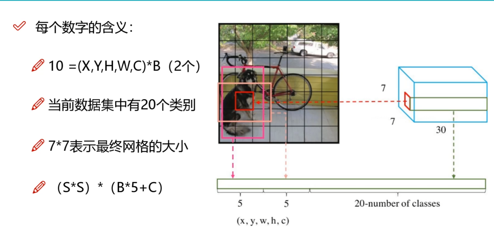
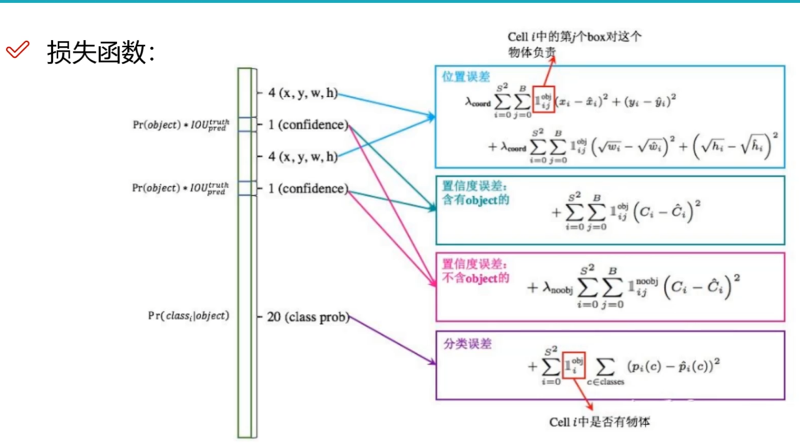

# YOLO检测
# 一、概述
## 1.1 经典的检测方法：
1. two-stage： Faster-rcnn Mask-rcnn系列
    1. 优点：效果好
    2. 缺点：速度较慢

2. one-stage： YOLO系列。
   1. 优点：速度快，适合做实时任务 
   2. 缺点：通常效果不太好

    
## 1.2 指标分析
1. map指标：综合衡量检测效果，
2. IOU： 真实值和预测值的交集 / 真实值和预测值的并集

## 1.3 评估参数的计算
1. precision： TP/（TP+FP）
2. recall： FP/（TP+FN）

## 1.4 map指标的计算：
较侧任务中的精度和召回率是什么？
基于置信度来计算（置信度代表检测目标为目标的可能性）
1. 将precision * recall的图画出来
2. 将所有的阈值都考虑进来
3. map值就是所有类别的平均，即面积。（越高越好）

# 二、YOLO-V1的思想和网络架构（You Only Look Once）
## 2.1 核心思想
1. 把输入分成S * S grid on input
2. 产生两种候选框
    其参数为（x,y,w,h)（bounding box）+ 置信度（confidence）
    1. 计算IOU值，选择IOU值大的
   
   
## 2.2 网络架构
1. 训练一个448 *448 *3 的结构
2. 结果为7* 7* 30的矩阵，其中（7*7为图大小，30中前5为bounding box1 参数
6-10为bounding box2参数，剩下20为每个类别的概率统计）

## 2.3 位置损失计算

## 2.4 置信度误差与优缺点分析
### 优点：

- 速度快：由于将检测任务简化为单个回归问题，YOLOv1 可以实现实时检测。
- 全局推理：YOLOv1 通过整个图像进行推理，有助于捕捉全局上下文信息。
### 缺点：
- 精度不高：由于网格划分的限制，YOLOv1 在小物体检测和精细定位上表现较差。长宽比可选，但较为单一
- 错误分类：由于 YOLOv1 的分类器是全局应用的，在某些情况下可能会导致错误归类。
- 每个cell只预测一个类别，重叠就无法解决。
# 三、YOLO-V2 改进细节
## 2.1 升级概述：
1. Batch-Normalization
   1. 舍弃了Dropout，卷积后加入了Batch Normalization
   2. 每一层的输入做了归一化，收敛相对容易
   3. 经过Batch Normalization后网络会提升2% mAP
   4. 从现在的角度，Batch Normalization称为网络必备处理

2. 更大的分辨率
   1. V1训练用的是224 * 224，测试是用448 * 448
   2. v2中额外进行了10次 448* 448
   3. 提高高分辨率分类器后，mAP提升了4%
   
3. 网络结构
   1. 加入了Darknet，没有全脸阶层
   2. 加入了降采样，得到最后的结果变成了13* 13
   3. 1 * 1卷积，节省了很多参数

## 2.2 聚类提取先验框
faster-rcnn 系列选的的先验比例都是常规的，但不一定完全适合数据集

V2使用K-means聚类（k=5）获得先验框

d(box,centroids) = 1-IOU(box,centroids) 

## 2.3 偏移量计算方法
1. 中心为（xp，yp）;宽和高为（wp，hp），则：
x = xp + wp* tx，y = yp+hp* ty
2. tx = 1，则bbox在x轴向右移动wp，tx = -1，则bbox向左平移wp
3. 这样会导致收敛问题，模型不稳定，尤其是在刚开始训练
4. V2中并没有直接使用偏移量，而是选择相对grid cell的偏移量

### 坐标映射量与还原

## 2.4 感受野
定义：特征图上的点能看到原始图像上多大的区域

越大的感受野代表越大的视野，从原始图像中得到的信息越多。

堆叠小的卷积核所需要的参数更少，并且卷积过程越多，特征提取就越明显，加入的
非线性变换就越多，还不会增大权重参数个数，这就是VGG网络的基本出发点。

## 2.5 特征融合改进
因为最后一层的感受野太大了，小目标可能丢失，需要融合之前的特征。

## 2.6 多尺度
小图像和大图像都可以使用卷积

