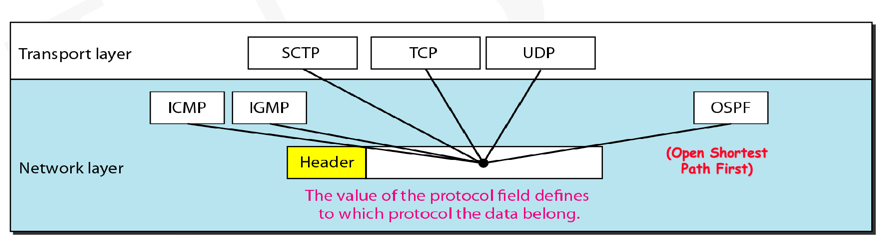

# Network Layer

## IPV4在TCP/IP中的位置

IP是一种无连接的协议，即在传输之前不会在网络上建立任何连接，因此IP并不可靠
甚至无法传输。图中可以看出IP是TCP/ip的核心。

## 源端网络层
源端网络层负责根据其他协议的数据创建数据包，它还负责检查其路由表以查找路由信息，
例如数据包的传出接口或下一个节点的物理地址。

## 网络层的目的地
目的地的网络层确保数据包的目标地址和主机地址相同。如果数据包是片段，它会等待完整的数据包
到达并且重新组装数据包。

以上两者的区别：目的地没有路由表的咨询，源和路由器都咨询路由器来寻找下一跳。

## 路由器的网络层
路由器或L3交换机的网络层负责路由数据包，当数据包到达路由器或者L3交换机时，它会查阅
其路由表并找到需要发送的接口，

## IPv4的数据包格式

### IPv4的服务类型：

### IPv4的TTL：
TTL时数据包通过互联网时施加的有限的生命周期，目的是防止数据包可能进入循环。

如果TTL字段在数据包到达目的地之前达到0，则数据包将被丢弃

##### Note：
数据包最终的目的地是应用程序，数据包的责任是传送到IP层。

### IPv4的协议位字段
IPv4的协议位字段用于定义IP服务的协议，它定义了数据包在最终目的地应传送的协议。
网络的路由器不关心”协议位“的字段，只有目的地会处理。

### IPv4的CheckSum
报头可能没有错误，但有效负载可能有错误，因此数据包将被传送到正确的目的地，但目的地会丢弃它。

IPv4不对整个数据包进行校验的主要原因：
1. 数据不会随跳数而变化而报头会
2. 所有上层协议对整个信息都有校验和
3. 减少路由器的处理延迟

## 碎片化和MTU（Maximum Transmission Unit）
如果包大小大于MTU，则包应该被分段。

数据包被丢弃的原因是什么？
1. 网络堵塞
2. TTL过期
3. 标头发现错误
4. D=1 且需要分段

M=1 表示该片段不是最后一个片段，M=0代表它是数据包的最后一个片段。

假设网络堵塞，网络中的路由器会优先处理碎片而不是非碎片的数据包，因为如果碎片延迟，整个数据包都会被丢弃。

## IPv4 地址

任何以127开头的地址都是环回地址，不会离开发送方的TCP/IP堆栈。

在x.y.z.t/n 中x.y.z.t定义了一个地址而/n 是掩码。

可以通过最右边的32-n位设置为0累找到块中的第一个地址

可以通过最右边的32-n位设置为1累找到块中的最后一个地址

可以使用2^（32-n）找到块中的地址数。

## 子网划分
由于子网是不同的网络，因此它们通过路由器连接，如果子网中的A想给B发信息，需要路由器的帮助

假设网络N分为S个子网，考虑N之外的节点X，节点X会将网络N中的所有节点视为网络的
一部分，无论它们属于哪个子网。

地址被分为网络部分和主机部分，因为太多的地址不方便管理，所以划分为不同的子网。

子网划分增加了一个层级结构：
即： netid  subnetid  hostid

## 子网掩码
子网掩码是一个32位，根据netid  subnetid  hostid计算出的。

实际上并非所有子网的大小都是相同的，同一子网上的所有主机都具有相同的子网掩码，
如果子网大小相同，则所有子网都具有相同的子网掩码，对于大小不同的子网，子网掩码不同。

子网掩码需要在每个节点中手动或由DHCP动态配置，掩码是从IP地址中提取网络地址或子网地址的过程。

掩码是将默认掩码或子网掩码与IP地址进行按位运算，生成网络地址。

## 无类寻址，地址分配

## 私人IP
私有网络只能和私有网络域之间的网络进行通信，无法连接外部互联网进行通信，如果它尝试给服务器发送
数据包，则会被丢弃。

## NAT代理服务器
NAT是一种代理服务器，可能是静态的或者动态的。

## NAT和PAT
NAT和PAT用于解决多个私有主机需要同时与公共网络通信的情况。

## IP数据包-传送、转发和路由
传送/交付：在网络层的控制下，底层网络处理数据包的方式

转发：数据包传送到下一站的方式，转发时网络层/数据链路层的过程

路由：创建路由表一帮助转发的方式。路由是根据某些标准发现并先泽到达目的地的
路径的过程。路由是网络层的过程。

### 路由表

### 转发模块和路由表

## 地址聚合

### 最长掩码匹配

## 分层路由

## RIP（Routing Information Protocol）
路由信息协议是一种基于矢量路由的非常简单的协议。

RIP不适合用于大型网络，因为RIP不可拓展。

