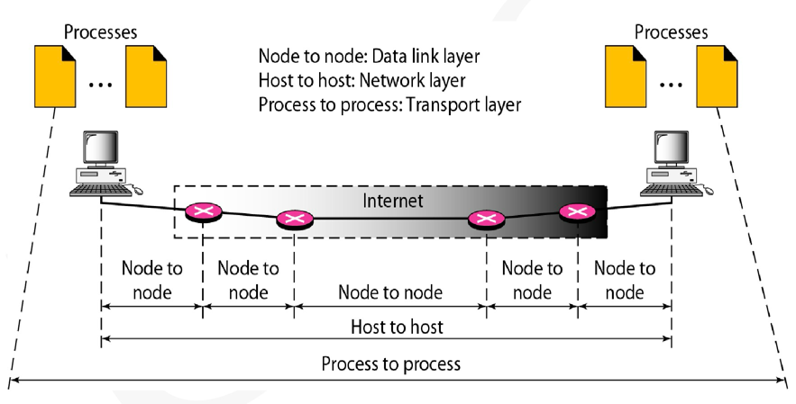
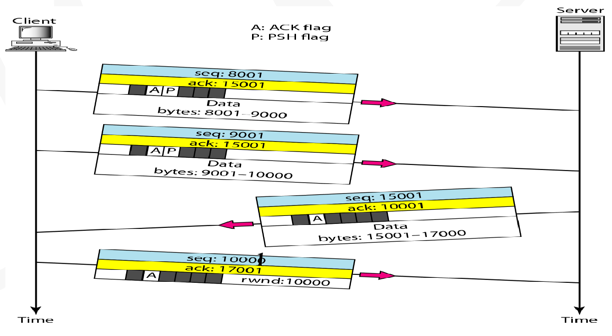
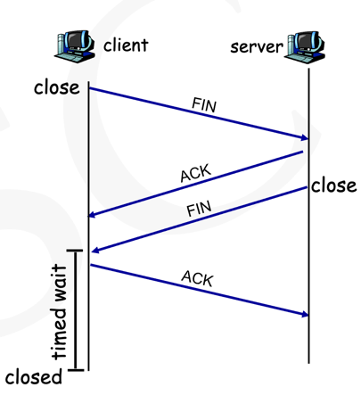
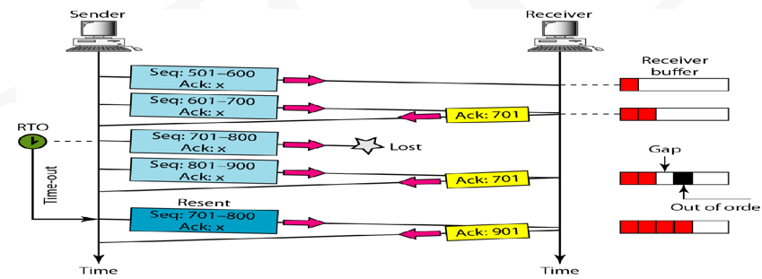
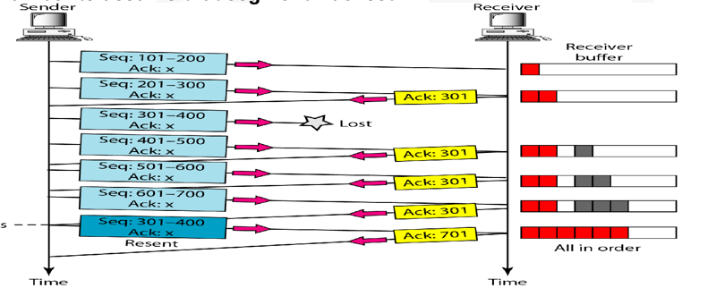
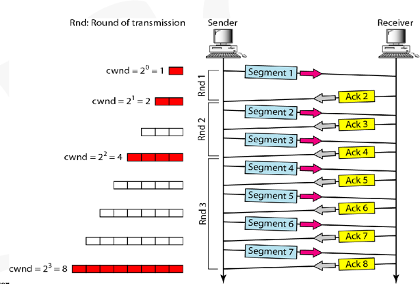
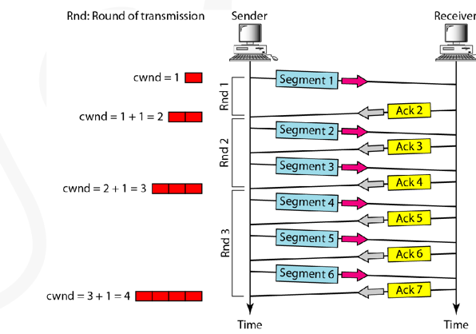

# Transport Layer

## 层关系

## 传输层协议
IP不提供完整的传输，IP仅将数据包传输到主机，封装在数据包中的内西需要传送到实际的应用层
此传送由传输层协议完成。

TCP/IP 定义了以下传输层协议，TCP（传输控制协议），UDP（用户数据报协议），
SCTP（流控制传输协议）。 TCP提供端到端的错误检测，错误控制，流量控制，拥堵控制。
UDP仅提供端到端错误检测。

IP地址，端口号，传输协议统称为套接字。

## 端口号
IP层提供报头错误检查，TCP和UDP对数据进行检查。

注意：路由器看不到端口号，端口号只是信息的一部分。

## UDP：
UDP是一种无连接的不可靠端到端协议。

无连接：如果本地进程有内容要传输到远程进程，它可以继续执行。

不可靠：如果检测到错误，直接丢弃包，而不会要求对方重新发送。
### UDP 数据报格式：
如果发送者是服务器，则它的端口号是众所周知的。

在第三层中IP报头检测仅针对报头部分。我们不希望路由器检查整个数据包二减慢速度。

## TCP：
TCP是一种面向连接的端到端协议，它在两个TCP之间创建虚拟连接以发送数据。

TCP是点对点的，因此它不支持广播或者多播，因为它是面向连接的，需要握手过程。

TCP提供全双工的服务，即双方都可以同时传输数据，在半双工中，事务以请求，相应的方式进行，
而TCP不是这样。

### TCP消息的分段
TCP的消息很大，因此我们需要将它们分成几段，必须使用序列号排序的方法进行
传输，保证信息的完整性。

### TCP的三次握手：
1. 客户端发送一个SYN段，设置S标志表示一个同步段
2. SYN和ACK不能携带数据，但会消耗序列号，服务器发送一个初始序列号。
3. 序列号同步完成后，客户端发送ACK段。

### 数据传输

### 四次挥手
客户端种植不意味着服务端没有更多字节发送给客户端。当客户端发送终止信号，
意味着客户端没有字节发送给服务端，但是服务端发送字节时，客户端要确认这些字节。

### 超时重传
RTO是指ACK未按时到达或根本没有到达的情况。

通常需要使用复杂的算法根据RTT计算RTO。

### 三个ACK之后重新发送

### TCP的流控制
1. ARQ
2. 三重复ACK

速度匹配：将发送速率与接收应用的消耗速率相匹配。

## 拥堵控制的原则
如果网络负载大于网络容量，则可能发生拥堵。

表现形式：
1. 据包丢失
2. 长时间延迟

### 流量控制和拥堵控制
流量控制是指接收方被填满，接收方告诉发送方它还有多少空间。

如果是网络堵塞，网络不会告诉主机它已堵塞。

流量控制比拥堵控制更加容易。

### 通告窗口和拥塞窗口
通告窗口（Advertised window）：会告诉发送方其缓冲还有多少空间，是一个动态参数。

拥塞窗口（Congestion window）：不会告诉发送方还有多少空间

### TCP Slow Start Phase

cwnd在收到ACK数据包以后重复更新一个数字。

总结：初始很慢，随后以指数速度增长

### TCP Additive Increase

### 实现对拥堵检测的反应方式如下：
Tahoe实现：如果检测是通过超时实现的，则开始新的慢启动（SS）

Reno实现：如果检测是通过3个ACK实现的，则开始新的拥堵避免阶段。

### TCP 拥堵控制的总结
当 cwnd 小于临界点时，发送者进入SS阶段。

当 cwnd 大于临界点时，发送者进入新的避免拥堵阶段。

发送三重复ACK时，临界点设置位cwnd/2，cwnd设置位阈值。

发生超时时，临界点设置位cwnd/2，cwnd设置为1MSS
