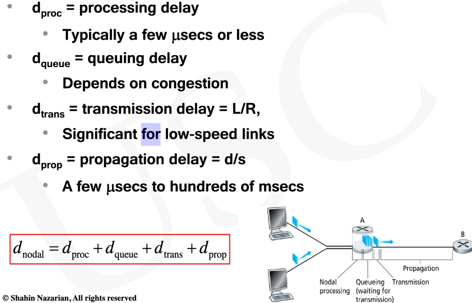
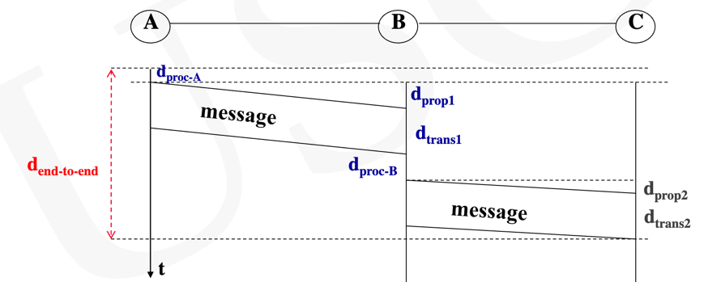
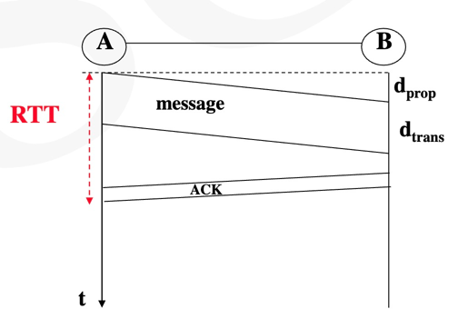

# Network Performance and Latency Measures

#### Part of contents are from Prof.Shahin Nazarian (USC)
#### 部分内容均来自USC的纳扎里安教授

## 4 Sources of Packet Delay
1. Nodal Processing Delay(节点处理延迟)
- Check bit error 检测字节错误
- Determine output link 确定输出链接

2. Queuing Delay
- Time waiting at the output link for transmission
- Depends on congestion level of routers

3. Transmission Delay
- R = link BW(bps)
- L = packet length
- Time to send bits into link = d(transmission)

4. Propagation Delay
- d = length of physical link
- s = propagation speed in medium
- Propagation delay = d(propagation)

## How do Loss and Delay Occur? 
Packets queue in router buffers(If packets arrival rate to 
link exceeds the ouput link capacity,packets queue,and wait 
for their turn)

## d(transmission)
d(transmission) is time it takes to push into the link all the 
message bits.It does not include the time it takes for message
to propagate and be received by the other end of the link.

## d(propagation)
d(propagation) is the difference between the time ones bit is
transmitted and the time, that one bit is received.

Note:d(propagation) dependents on the link length

Noted:d (propagation)and d(transmission) have no relation between each other

## Queuing Delay,d(queue)
For each attached outbound link, Router A has an output buffer
(aka the output queue) which stores packets that the router is
about to send into that link

When a message (a packet) arrives at router A from an
upstream node, router A examines the packet’s header to
determine the appropriate link to direct the packet to

### d(queue)
d(queue) is the amount of time a packet needs to wait in the 
queue of a router.If the queue is empty,then d(queue) is 0.

If network is congested the queue of router A will eventually
become full, and if more packets come, the buffer will drop them
typically based on the last come, first drop criteria

d(queue) = I(L/R)(1-I)    for I < 1

I is traffic intensity I = La/R

## Processing Delay(d(process))
Nodal processing delay is the time required to process the packet at
the source prior to sending, at any intermediate router or switch,
and at the destination prior to delivering to an application
#### The main components for processing delay, d(proc)[For node A]
- The time A needs to check for bit-level errors in the packet
that may have occurred in transmitting from upstream to
router A
- The time A needs to examine packet’s header and determine
where to direct the packet (routing decisions)
#### Queuing Delay and Processing Delay Depend on the number of packets in the queue (buffer) and how congested the network is
 
## Nodal Delay

#### d(proc) is ofter negligible but is strongly influences a routers's max throughput
#### d(trans) typically negligible for rates of 10Mbps and higher (LANs).
#### d(prop) can be negligible if the two routers connecting the link are close
#### d(queue) varies from packet to packet and is the most complicated component of d(nodal)

## End to End Delay
end-to-end delay is the difference between the time the
first bit of the message is processed and transmitted by the
source and the time the last bit of the message is received by the
final destination host

## RTT(Round Trip Time)

If A and B are connected through N routers:
RTT = 2(N+1) d（prop）

## Throughput（bps）
Throughput is the ratio of the message length to RTT; in other words, it is the number of reliably
delivered bits per unit time

Throughput = L (bits) / RTT (sec)

The number of bits that are sent per unit time(offered load) is not equal
to the number of bits actually delivered(carried load/throughput)

## Bandwidth
Bandwidth is the number bits per second that can be transmitted
on a link. It's same as the bit rate,R,we used in d(trans) equation.

Note1:Bandwidth is typically measured in hertz

Note2:Unlike throughput,the definition of bandwidth dose not
consider the message reliability

## Bandwidth-Latency Product
Bandwidth*Latency = maximum number of bits that can be in transit through the pipe.

