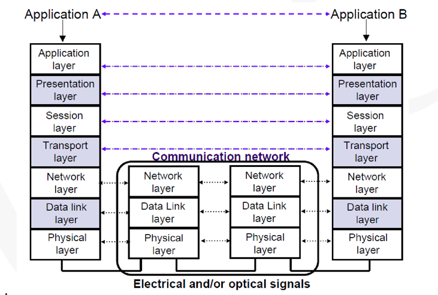
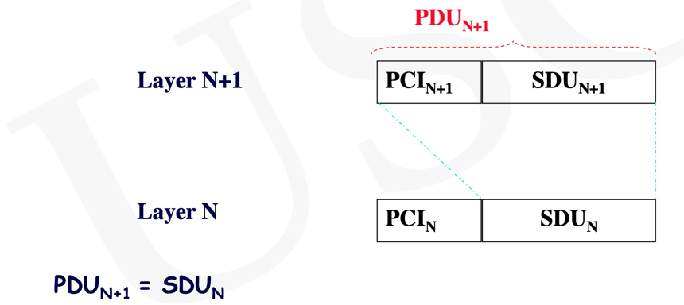
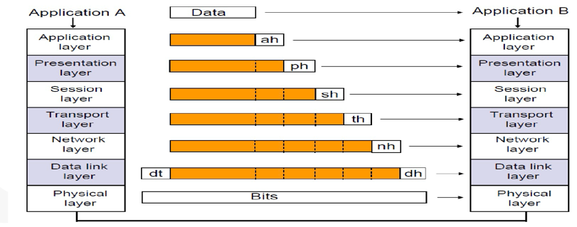
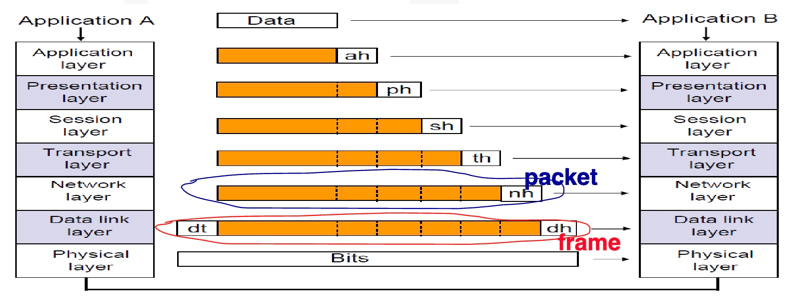
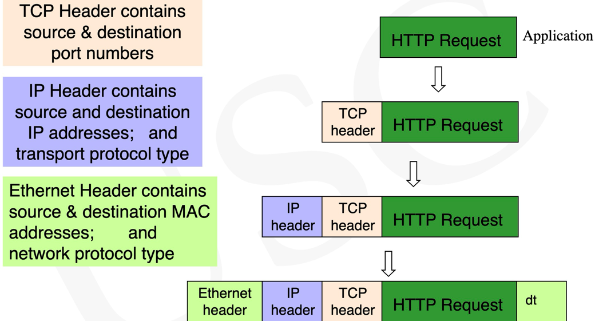
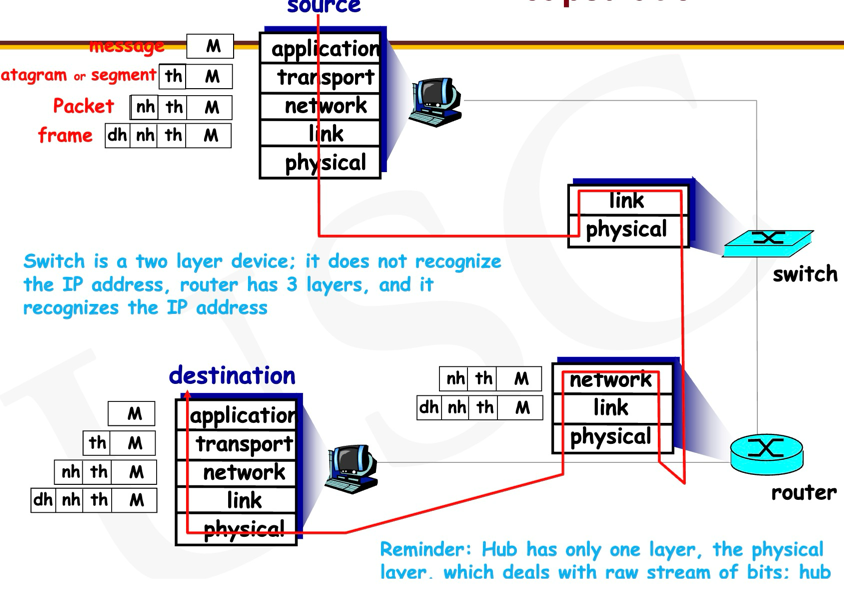

# Protocol

## OSI Layers
1. Physical
2. Data Link
3. Network
4. Transport
5. Session
6. Presentation
7. Application

## Adjacent Layers
Adjacent layers are the neighboring layers in the same node.
Adjacent layers communicate with each other via interfaces
also called Service Access Interfaces

Note：Unlike peer layers, adjacent layers do NOT
communicate with each other via protocols, because they do
not understand each other, e.g., if Application layer uses
SMTP, Presentation layer does not understand what SMTP is,
so it needs an interface

## SDU and PDU
SDU(Service Data Unit) is the payload

PCI(Protocol Control Information):the header which has the protocol information

SDU+PCI = PDU(Protocol Data Unit)(combination of protocol and data)

Note:PDU(n+1) = SDU(n),also Layer N gives service to layer N+1

Similarly the entire thing (PDU) from the Presentation
layer is taken by Session layer as the data (SDU) and
session header (sh) is added to it

## Application Layer

It enables the user, whether human or software to access the
network. It provides user interfaces and support for services
such as electronic mail, etc

## Presentation Layer
The presentation layer is responsible for translation,
compression, and encryption(加密)

## Session Layer
Session layer is responsible for dialog control (establishing and
maintaining communication among systems) and synchronization
[of communication among systems]

- Dialog Control: Allows FDX or HDX mode communication btn
two systems (another words, two processes)
1.	FDX（Full Duplex，全双工）：
    1. 简介：全双工通信是一种通信方式，允许设备同时发送和接收数据。也就是说，在同一时间内，通信的双方都可以进行双向的数据传输。
    2. 特点：
        1. 同时进行数据的发送和接收。
        2. 提高了通信效率，因为不需要等待另一方完成数据传输后再开始传输。
        3. 常用于高速通信网络，例如以太网交换机、电话系统等。
2.  HDX（Half Duplex，半双工）：
	1. 简介：半双工通信是一种通信方式，在任何一个时间点上，通信的双方只能有一方发送数据，另一方只能接收数据。这意味着数据传输是双向的，但不是同时进行的。
    2. 特点：
        1. 数据传输是双向的，但每次只能在一个方向上进行。
        2. 通信效率较低，因为需要等待另一方完成数据传输后才能开始传输。
        3. 常用于对讲机、早期的计算机网络等。
- Synch.: Session layer allows a process to add checkpoints
(synch. points) to a stream of data, e.g., if a sender is sending
a 2000 page file, it may insert synch. points every 100 pages
to ensure each 100 page is received and acknowledged
independently

## Transport Layer
The transport layer is responsible for the delivery
of a message from one process to another

## Network Layer
The network layer is responsible for the delivery of individual
packets. Two main responsibilities: Logical addressing (to specify
the sender, receiver address), and routing

## DataLink Layer
The data link layer is responsible for moving frames from one
hop (node) to the next
Main responsibilities:physical addressing (for local delivery), flow
control, error control, access control

## Physical Layer
The physical layer is responsible for movement of individual
bits from one hop (node) to the next.

### OSI Data Transfer

## Packet Frame Bit

The network header(nh) has IP address of the host and IP
address of the destination.

Note:The Data link layer looks whole packet as the data,add
dh and dt to it. The whole PDU is called frame.

## Layer Functionality:
#### Physical Layer
        The responsibility of the physical layer is that for each bit
    the Physical layer of the sender of the bit transmits, the
    receiver physical layer receives a bit.
        Physical layer needs to change the electrical signal
    generated by the computer to the proper form for the
    medium
#### Datalink and Network layer
    1.find out where the frame starts and where it ends

    2.Data Link layer also does node-to-node (or link-to-link)
    error detection by checking the frame trailer (dt). dh
    has some bits for the purpose of error detection so
    that the receiver side can detect possible errors by
    checking them

    3.Data Link layer also needs to know the Data Link layer
    of the sender node (i.e., its MAC address) to re-
    transmit if the protocol necessitates retransmission
    after error detection

    4.Main functionality of Network layer is addressing and
    routing, meaning which router should be chosen next

#### Transport and Application Layers
    Very IMP:In the process of data transfer in
    TCP/IP or OSI model, once we get to the Transport
    layer we are outside of the network
    
    Transport layer deals with end-to-end message
    delivery and error recovery, because some errors may
    be able to pass through the Data Link layer, so the
    Transport layer is considered as another layer to
    provide recovery, however Transport layer recovery is
    end-to-end whereas Data Link does node-to-node
    recovery

## Summary Graph:

Note:The end-to-end application later connections are not
physical,they are just agreement.

## DNS
DNS(Domain name system): resides in the Session Layer.It
does not interact with the end user.

    

