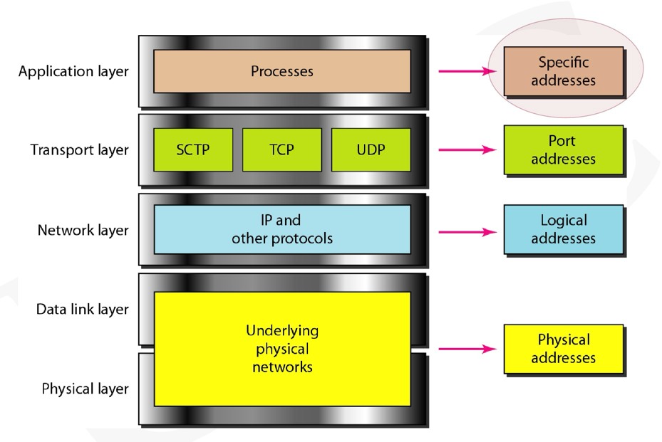
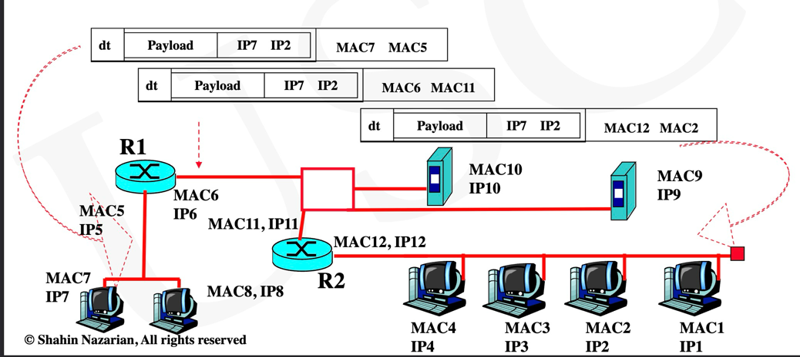
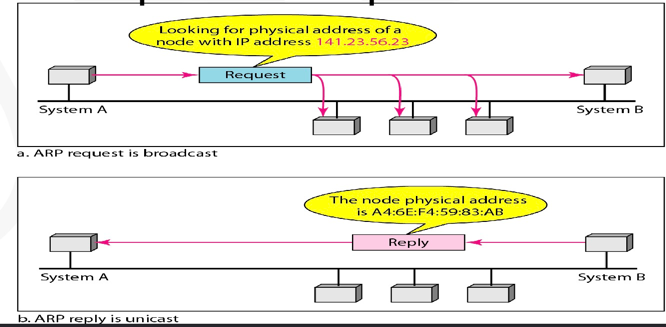
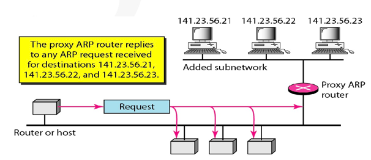
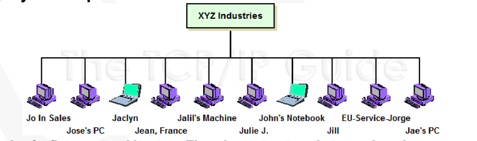
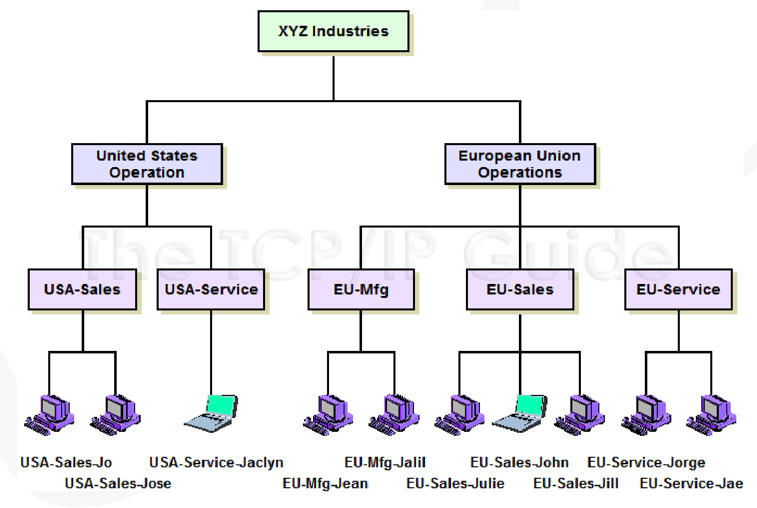
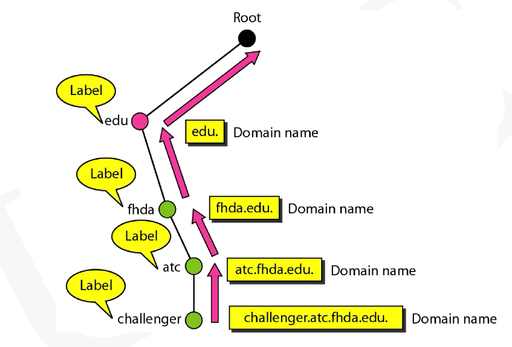

# Network Address\ARP\DNS\DHCP

## TCP/IP Address - Physical Address
Physical Address(MAC Address or DLC Address)
(MAC:Medium Access Control;DLC:Data link control)

If a computer is connected to an Ethernet and needs to be
connected to another Ethernet, there is no need to change the
NIC, as the NIC can be recognized by the new Ethernet via
NIC’s global address

假设有一台笔记本电脑，带有网卡，其MAC地址是00:1A:2B:3C:4D:5E。当该电脑在家庭网络中时，可能会被分配到IP地址192.168.1.10。如果用户带着这台笔记本去咖啡馆并连接到咖啡馆的Wi-Fi网络，咖啡馆的DHCP服务器可能会分配一个新的IP地址，例如10.0.0.15。然而，笔记本的MAC地址仍然是00:1A:2B:3C:4D:5E，不受网络变化的影响。

The physical address is in layer2 or Datalink layer;not in Physical layer

Length: 48 bits, divided into six 8-bits

## TCP/IP Address - IP Address
IP address (aka layer 3 address) goes into the network
header (nh) (i.e., packet header) and is for the purpose of
packet delivery (which is an incomplete delivery) to the
Network layer.

Length:32 bits,divided into four  8-bits

## TCP/IP Address - Port Address
Port address goes into the Transport header (th) [remember
that TCP/IP does not have a Session or Presentation layer, so
Application layer is right on top of the Transport layer]

Keep in mind that the port address resides in the header of
either the segment or datagram depending on which
Transport layer protocol (TCP or UDP) is used for the
corresponding application

The maximum number of port addresses is 216, which is
currently enough for the number of applications, however it
is not guaranteed that in the future it would be enough
- Note that we need one port address for the client
application and another for the server application, to be
able to indentify the right application on the client
machine and as well on the server machine

A port address has 16 bits and is represented by a decimal number

example of special address: trojan@usc.edu

## Internetwork Communication

In Internet communication, IP addresses do not change while
the frames (and packets) are traversing the networks, but the
MAC addresses do change

## ARP(Address Resolution Protocol)
ARP is a simple, layer 3 protocol and provides IP with
its service. ARP resides underneath the IP (both on
the Network layer)

## Proxy ARP
In case of proxy ARP, the end systems are all
logically on the same network, but some (the ones in
the added subnetwork) are physically on different
cables; the end systems’ network address is the
same, however the network administrator puts some
end systems in the back, so that nobody can reach
them from outside the LAN due to security reasons

## DHCP(Dynamic Host Configuration Protocol)

### Offer Phase:
Offer phase packet by DHCP server: source IP address is DHCP’s IP,
and destination’s IP address is still 255.255.255.255

However inside the offer message: DHCP server offers N the IP
address x.y.z.w and a lease time, e.g., 24 hours

This is just an offer, now if N wants it, it needs to request it

Note that multiple DHCP servers may respond to N, so N will have
multiple offers with possibly different lease times.

### Request Phase:
Request phase: The new client (N) sends a packet (broadcasts
the request) in case N received multiple DHCP offers; however if
there was only one offer, then destination IP address is the
DHCP server’s IP address

In case of multiple DHCP offers, N needs to broadcast the
request to let all DHCP servers know which offer N is choosing,
so that other DHCP servers whose offers, N did not select, can
take the IP address they offered to N, back to the pool of the
available IP addresses

The frame is broadcasted

The request message that N sends implies that N likes the offer
(IP address: x.y.z.w with the offered lease time,) however the IP
is not N’s yet. DHCP needs to send an acknowledgement to N,
and then that IP is finally N’s

### ACK Phase:
ACK-phase is by the DHCP server. The packet has source IP
address of DHCP server and destination is still a broadcast
address. The message implies to N that the IP address that
was offered and N requested is given to N. N can then start
using that certain IP

## DNS(Domain Name System)
#### Name-Space FLat

#### Name-Space Hierarchical

## Recursive DNS & Iterative DNS

