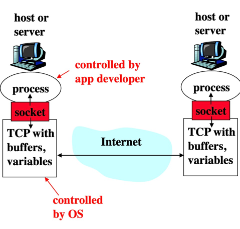
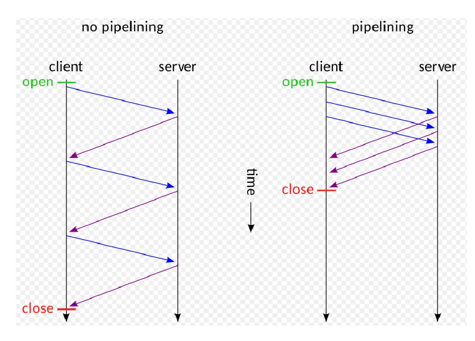
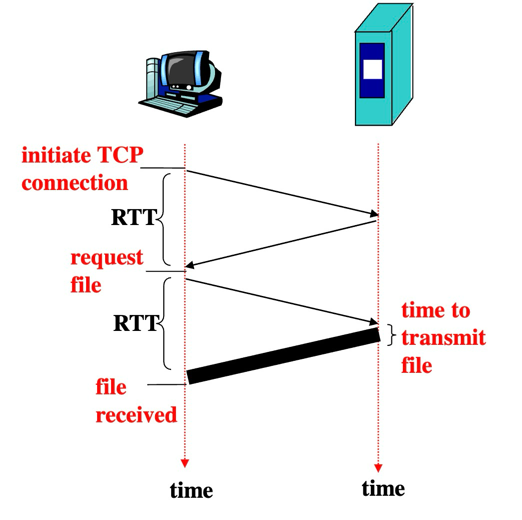
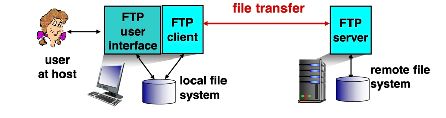

# Application Layer - HTTP and FTP

## Application architectures
1. Client-server
2. Peer-to-peer(P2P)
3. Hybrid of client-server and P2P

### Client-server archicture
#### Server
1. always on host
2. permanent IP address
3. server farms for scaling
#### Client
1. communicate with server
2. may be intermittently connected
3. may have dynamic IP address
4. do not communicate with each other

### Pure P2P architecture
1. No always on server
2. arbitrary end systems directly communicate
3. peers are intermittently connected and change IP address

- disadvantage: difficult to manage

## Processes communicating
Process：program running with a host
- Same host two Processes communication： inter-process communication
- Different hosts：exchanging message

### Client Process：
Process that initiates communication

### Server Process:
Process that waits to be contacted

Note: application with P2P have Client Process and Server Process

## Sockets:

## APP-Layer protocol defines
1. Types of message exchange
2. Syntax of message types
3. Semantics of the fields
4. Rules for when and how processes send

### An APP services need:
1. Date loss(some can loss/some can't)
2. Timing(low delay)
3. Bandwidth(some low/some get full)

## TCP and UDP services
### TCP service：
1. connection-oriented
2. reliable transport
3. flow control
4. congestion control
5. does not provide:timeing,minimum bandwidth guarantees

### UDP service:
1. unreliable data transfer
2. dose not provide: 
    1. connection setup
    2. reliability
    3. flow control
    4. congestion control
   5. timing or bandwidth guarantees

## Web and HTTP

### HTTP(HyperText Transfer Protocol)
- client:browser that requests,receives"displays" Web objects
- server:Web server sends objects in response to requests

Note:HTTP is stateless

### HTTP connections
#### Non-persistent HTTP
At most one object is sent over a TCP connection
- Issue:
requires 2 RTT per object
#### Persistent HTTP
Multiple objects are sent over a TCP connection

Server leaves connections open after sending response

### Response time modeling
RTT: send a small packet to travel from client to server and back

Total time = 2RTT + transmit time

## HTTP Request Message
2 types: request,response

### Uploading form input
1. Post method
   1. web page ofter includes form input
   2. input is uploaded to server in entity body
2. URL method
   1. Uses Get method
   2. input is uploaded in URL field of request line

### HTTP status codes:
200: OK

301:Moved Permanently

400:Bad Request:request message not understood by server

404:Not Found

505:HTTP version not supported

### User-server state: cookies
#### Four components:
1. cookie header line in HTTP response message
2. cookie header line in HTTP request message
3. cookie file kept on user's host and managed by user's browser
4. back-end database at Web site

#### Cookies bring:
1. Authorization
2. shopping carts
3. recommendations
4. User Session state

### Web Cashes(Proxy server)
when browser sends all HTTP requests to cache:
- object in cache: cache return objects
- objects out of cache:cache sent HTTP request to server

Advantages:
1. Saving time
2. Reduce traffic

## FTP:(File Transfer Protocol)

## Electronic Mail
### Three major components:
1. user agents
2. mail servers
3. simple mail transfer protocol

### Mail Server
1. mailbox contains incoming messages for users
2. message queue of outgoing(to be sent) mail messages
3. SMTP protocol

