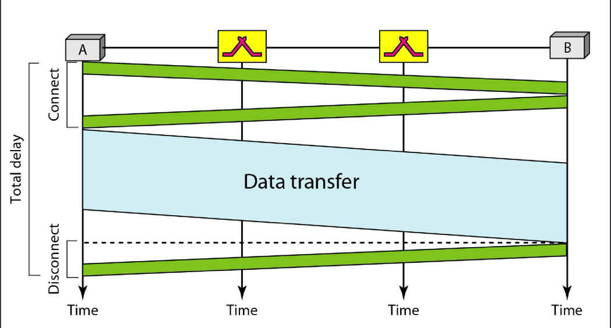
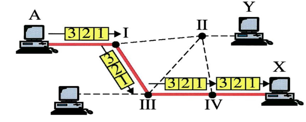

# Switching Technologies

## Two main switch technologies:
1. Circuit-switched(used in PSTN)
2. Packet-switched(used in Internet)
   1. connectionless (eg.IP)
   2. connection_oriented(eg.ATM and FR)
   
## Circuit-switched Network

### Circuit-switched Total Delay

### Connectionless Packet-switched
In circuit switching addressing is done only during call setup, and
once the circuit is set up, we don’t need any addressing, because
the resources are going to be dedicated

However in connectionless packet switching networking,
everything is shared and there is no dedicated resources, so the
message is broken into packets and each packet needs to be
addressed to let the router know where to send the packet.
That is the reason we put the address of the source and
destination in the header of the packet

Connectionless is a best-effort service,meaning that packet
delivery isn't guaranteed.

### Compare:
Remember that circuit-switched network is not
optimized for burst traffic, i.e., data

Similarly connectionless packet switching is not
optimized for stream type (real time) traffic

#### Packet  or  Switched ? 

1) The links (trunks) that are high bandwidth and very
costly, are shared by a far more number of end
systems. Circuit switching technology is very inefficient
for burst type in that sense
2) Packet switching technology is more fault-tolerant,
meaning if some nodes or links on the path become
defective or do not function any longer, communication
could still be possible with rerouting the packet. In
circuit switching if the circuit does not function any
longer, the calls will be disconnected

## Virtual Circuit Switching(Connection-oriented Packet Switch)
The notion of packet switching in virtual circuits implies that
store–and-forward is still the concept

While being transmitted, the packets will follow the same
virtual connection that was set up, but based on store-and-
forward

Can the packets be received out of order? No, they will be in
order, because they are following the same route

### Virtual Circuit Switching
Instead of destination address, every frame contains a VCI (Virtual
Circuit or Channel Identifier) assigned by the network

A VCI-based lookup table is used to fwd the frame. Destination
address is not required, because all the packets are going to follow the
same virtual connection (route)

After the communication is done, the virtual connection is cleared, similarly
to what is done in a real circuit switching

The packets will follow the same route, so the routing decision is done only
during the virtual connection, afterwards routers won‘t make routing
decisions. In virtual circuit switching if something goes wrong with one of
the links that is along the virtual connection, the virtual connection will be
dropped

