# Physical Layer

## Main Responsibility
Definition of Hardware Specifications: The details of operation
of cables, connectors, wireless radio transceivers, network
interface cards and other hardware devices are generally a
function of the physical layer (although also partially data link
layer)

Encoding and Signaling: The physical layer is responsible for
various encoding and signaling functions that transform the
data from bits that reside within a computer or other device
into signals that can be sent over the network

## Data and Signal
Data can be analog or digital

Analog data are continuous and take continuous values,have an infinite number of values in a
range, for example sound or video

Digital data have discrete states and take discrete values,have only a limited number of discrete
values like integer numbers, however they typically have two
levels, e.g., 0 and 1 or -1 and +1

## Periodic Signal
#### Three parameters
1.  frequency
2.  perk amplitude
3.  phase

### Time Domain and Frequency Domain
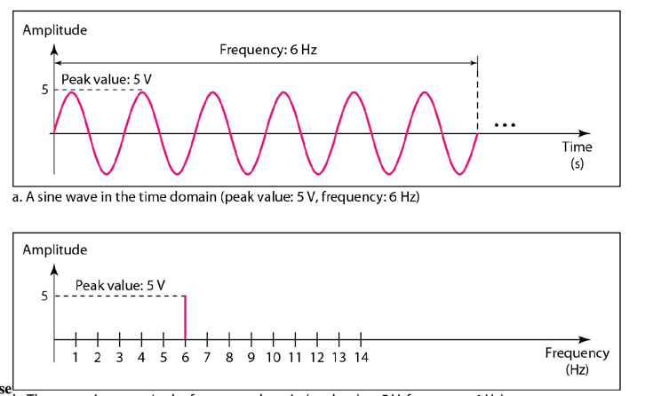

## BaseBand,PassBand and Broadband(基带，通带，宽带)

#### Baseband
run from 0 to maximum frequency

A baseband transmission devotes the entire capacity of the
medium to one communication channel, e.g., most of the
LANs are baseband

Baseband to passband conversion: (0,B) -> (S,S+B)
#### Passband
Passband signals are shifted to occupy a higher range of
frequencies, e.g., wireless transmissions use passband
signals

#### Broadband
A broadband transmission enables two or more
communication channels to share the bandwidth of the
communications medium, such as TV

## Composite Signal
1. 周期性复合信号可以被傅立叶分解为离散的多个频域信号的和
2. 非周期性的复合信号可以被傅立叶分解为连续的频序信号
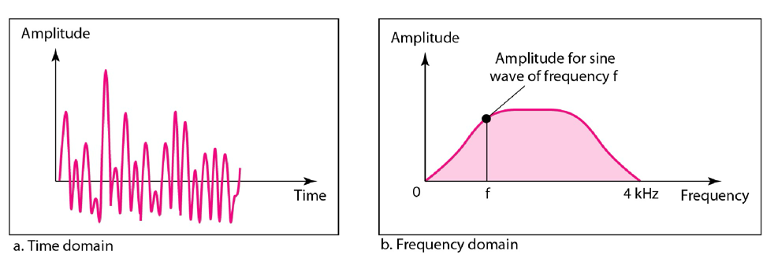

### Bandwidth of the Composite Signal
Bandwidth of a signal is defined as its range of frequencies
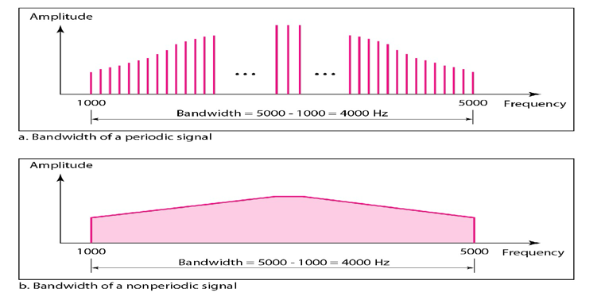

## Digital Signal
#### digital signal bandwidth
Bit rate, R (and hence the bandwidth) is inversely proportional
to the bit duration Tbit. Therefore the narrower the pulse, the
shorter the bit duration and then the higher the bit rate (and
the bandwidth)
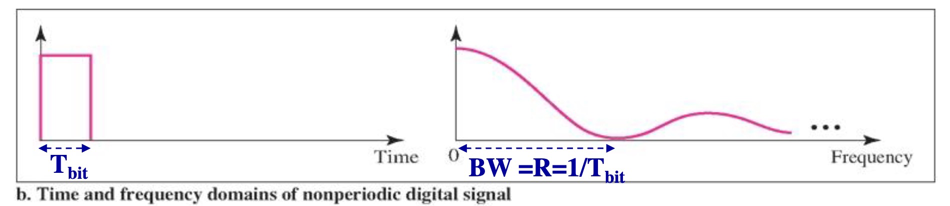

## Signal to Noise Ratio, Bit Error Rate
SNR = power of signal / power of the noise

SNR(dB) = 10 log10(SNR)

## Shannon's Theorem
Assume the system bandwidth is B(in Hz) then the channel
capacity is C

    C = B log2(1+SNR)

Shannon’s theorem states that the maximum transmission bit
rate, R should be the channel capacity to achieve reliable
transmission, i.e., low BER

    R <= C = B log2(1+SNR)

## Analog Data Transmission
### A/A
Data signal can be analog and represented by analog
signal. E.g., sound signal is analog and a telephone system
would convert analog sound into analog signal

### D/A
Data signal can be digital and represented by analog
signals. E.g., if you use dialup, DSL, or cable connection to
your computer, the data sent out from your PC is digital. A
Modem would convert the digital signal to analog to make the
data suitable for the medium to transport

## Modulation
Modulation is the process of varying one or more of the key
parameters (amplitude, frequency, phase) of a carrier signal
in relation to the information signal

## Baud Rate
Bit rate, R, is the number of bits per second

Baud rate, R-baud, is the number of signal elements per second.
It is also called the signal rate, pulse rate, modulation rate,
and synonymous to pulses per second or symbols per second

## Analog Transmission - D/A or Modulation
Binary modulation: for every bit of information that
enters the modem, one modulated signal comes out:
Rbaud = R

Multi-level modulation: for every k bits of
information that enters the modem one modulated
signal comes out: Rbaud = R/k

## D/A - Modulation Techniques
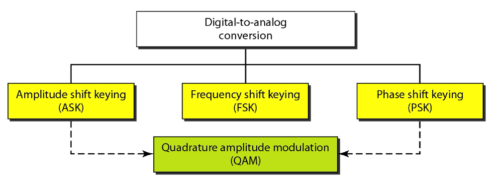

### Amplitude Modulation
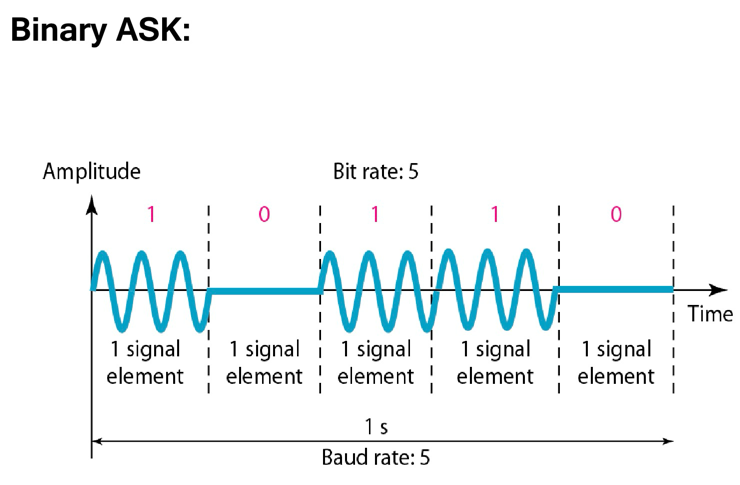
### Frequency Modulation
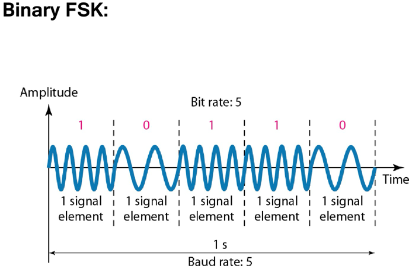
### Phase Modalation
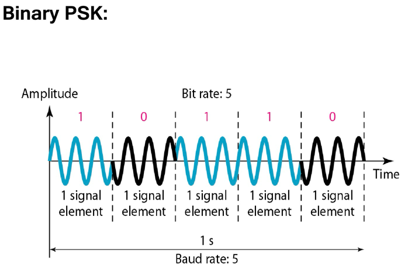

### QPSK(Quadrature Phase Shift keying)
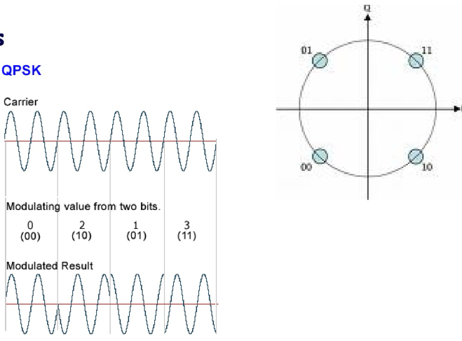
### QAM(Quadrature Amplitude Modulation)
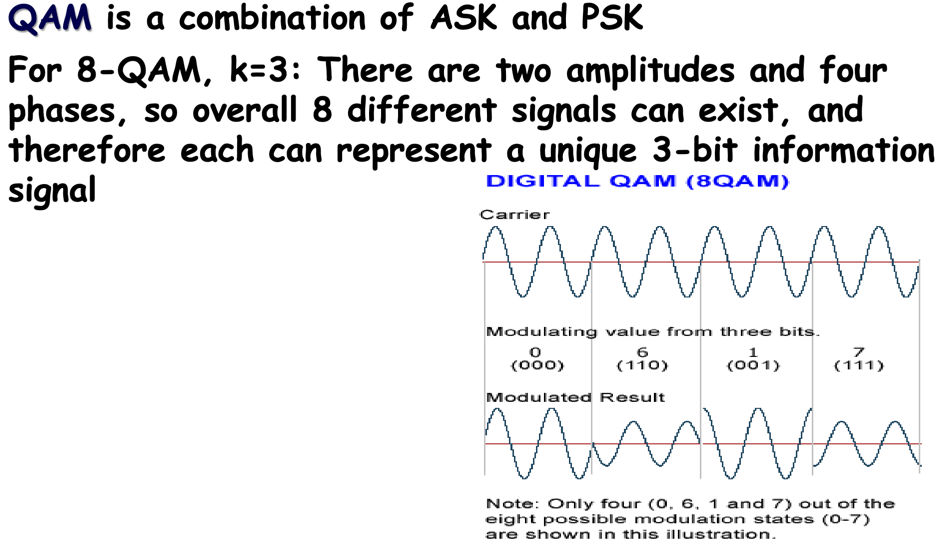

## Digital Transmission - A/D
In digital transmission, in case of analog to digital conversion, 3
steps are required: sampling, quantizing, and encoding

#### PCM(Pulse Code Modulation)
#### PAM(Pulse Amplitude Modulation)

### A/D – Sampling Using Nyquist Theorem
According to the Nyquist Theorem, the sampling rate must be
at least 2 times the highest frequency contained in the signal

### AD- Quantization
The sampling rate after quantization is the same as that before
(is equal to fs samples per sec)

## Digital Transmission – D/D
The process of converting a digital signal into another
digital signal is called Line Coding

### NRZ NRZ-L(Non-Return-to-Zero,) NRZ-I (Non-Return-to-Zero-Inverted
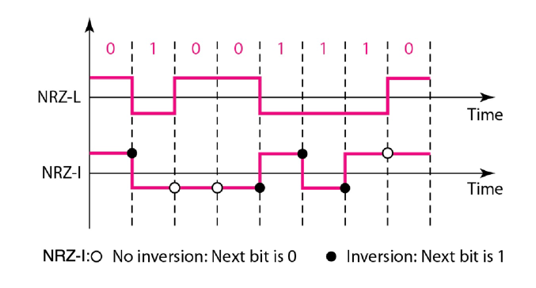

NRZ weakness: Receiver side would have a
synchronization problem for long strings of 0s or 1s in
the coded signal (e.g., in NRZ-L when the original
message has long strings of 0s or 1s)

## Manchester/Differential Manchester
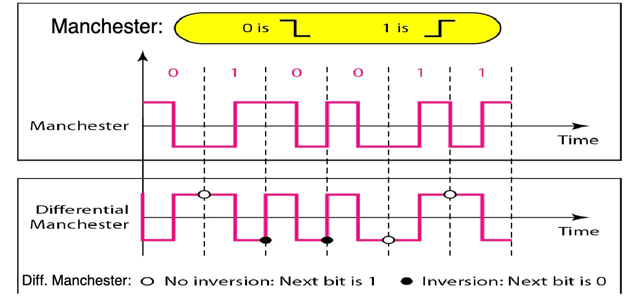
The disadvantage of Manchester/Differential Manchester is that
bandwidth of Manchester code is two times that of the NRZ

## example on Clock Synchronization
In a digital transmission, the receiver clock is 0.1 percent
faster than the sender clock. How many extra bits per second
does the receiver receive if the data rate is 1kbps?

At 1kbps, the receiver receives 1001bps instead of
1000bps

## Multiplexing (Bandwidth Utilization)[多路复用(带宽利用率)]
Multiplexing (aka resource sharing) is the set of
techniques that allows the simultaneous transmission of
multiple signals across a single data link. Therefore
multiplexing results in efficiency
### Multiplexing Classification
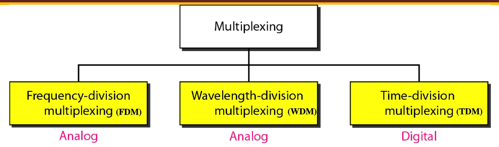

#### FDM (Frequency Division Multiplexing)
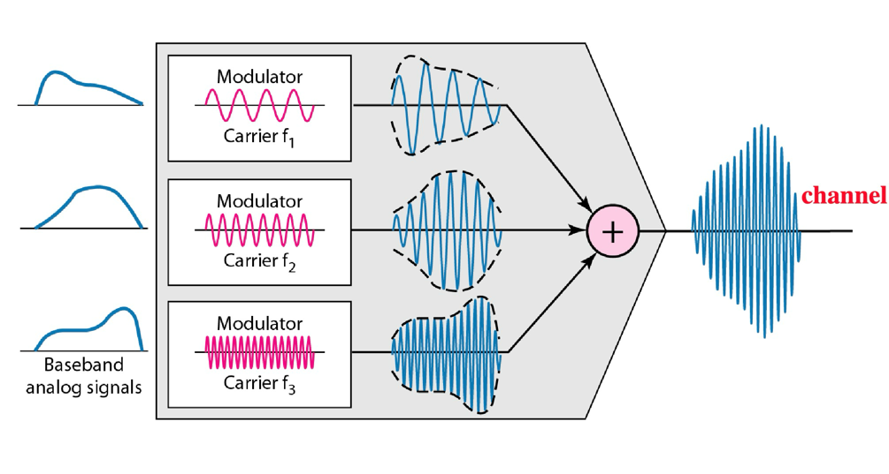

#### WDM (Wavelength Division Multiplexing)
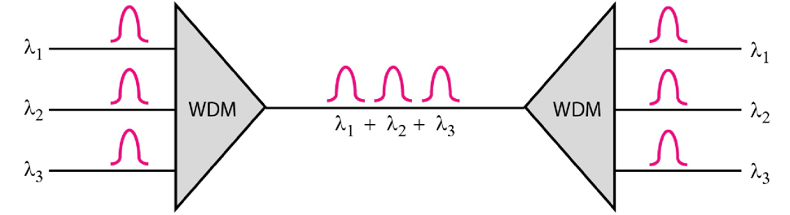

#### TDM
Multiplexing may happen at bit level or block of bits

Using the TDM multiplexer it picks up one bit from A, one from B,
and one from C
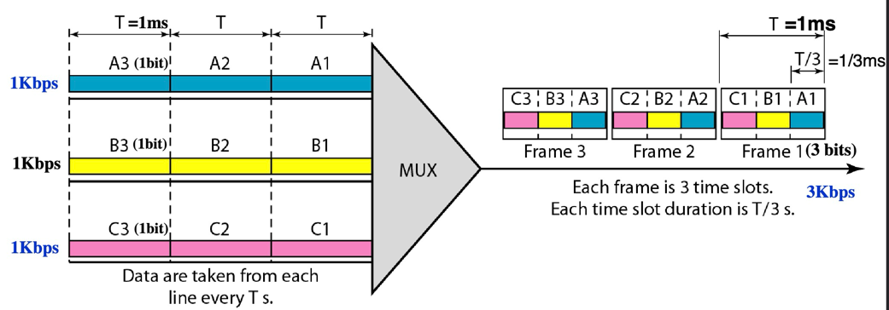

#### TDM-digital Hierarchy
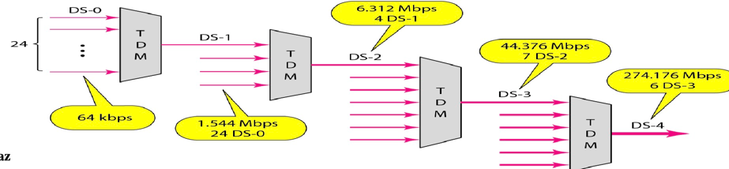

#### Statistical TDM
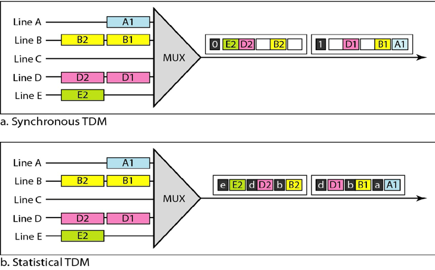

## Pulse Stuffing
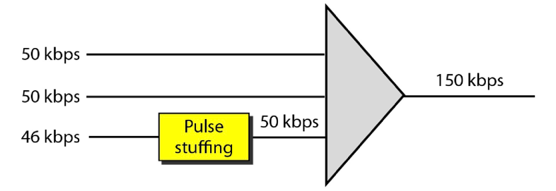

## Access Technologies - Dialup
In dial-up service the bandwidth of the voice and data overlap, therefore it is
not possible to later separate them, i.e., we cannot make a phone call and
data call at the same call

## ADSL
ADSL is an asymmetric communication technology designed for
residential users and is not suitable for businesses

## Telephone Company Site: SALAM
At the telephone company site, instead of an ADSL modem a DSLAM
(DSL Access Multiplexer) is used that functions similarly to the ADSL
modem, but additionally packetizes the data to be sent to the Internet
(ISP). It is a statistical Mux (in fact Demux) that is used as a
demodulator

