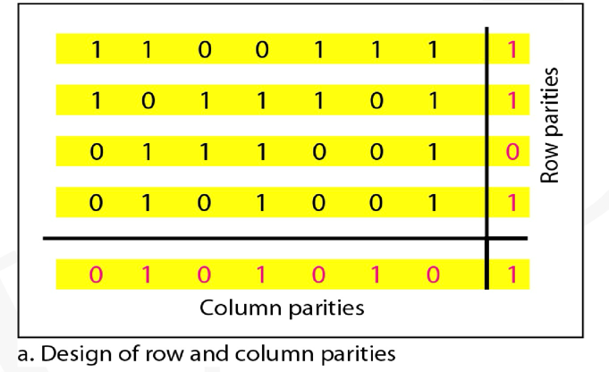

# Data Link Layer - a Link to Link Protocol

## DLL Services
1. Framing:
    Frame synchronization, adding headers and trailers and encapsulating packet into frame
2. Error detection:
    Frame Check Sequence
    
    Receiver drops the frame in error detection,or ARQ(Automatic Repeat reQuest) protocols

3. Flow Control:
    Prevent buffer overflow at the receiver

## Point to Point DLC Protocols
1. PPP(Point-to-Point Protocol)
   1. Only erroe dectection
   2. No flow control
2. HDLC (High-level Data Link Control)

## Framing
Framing in DL layer separates a message from other messages
如果整个消息都是一个帧，那么流量和错误控制就会变得低效，因此消息通常被分为多个较小的帧。
1. Fixed-size Frame:
    No need to define the boundaries of the frame;the size itself can be the delimiter

2. Variable-size Framing
    Need to define the beginning and the end
    分为两种，面为位（bit-oriented），面向字节（byte-oriented）

### 面向字节（byte-oriented）
头和尾都是8位bit的倍数，在开头和结尾添加8位以分割开帧
### 面向位

## 错误检测
位了检测和纠正错误，需要在帧中随着数据发送额外的位
例如：CRC 和 FCS（Frame Check Sequence）

### 奇偶检验-单比特奇偶检验/二纬比特检验

### 循环冗余校验（Cyclic Redundancy Check）和 FCS（Frame Check Sequence）

## 超时和 消极ACK

## Protocols

#### Noiseless Channels - Simplest Protocol
#### Noiseless Channels - Stop & Wait
The receiver tell sender to slow down to avoid becoming overwhelmed

Stop & Wait 的协议效率不高，因为只能发送一帧，然后发送方需要等待ACK
在网络领域，一个任务结束前开始下一个任务，称为流水线，但是Stop & Wait 并不是流水线

## Go-Back-N ARQ
定义一个窗口，发送方一次发送多个帧，收到ACK后向后移动窗口，如果没有收到ACK则在
timeout后重新发送。

缺点：对嘈杂的链路非常低效，损坏率较高。对于嘈杂的链路使用选择性重复ARQ

##  Selective repeat ARQ
和上边的传输方式相似，但是重复性ARP会指定损坏的帧，并且要求发送者重新发送仅仅
损坏的包。

## 搭载（Piggybacking）
搭载用于提高双向协议的效率，双方使用相同的搭载算法非常重要

## Medium Access Control（MAC） Protocol

## 

