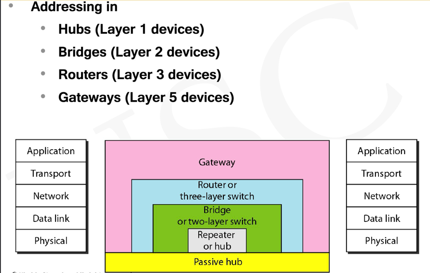
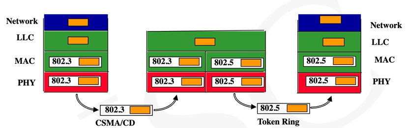
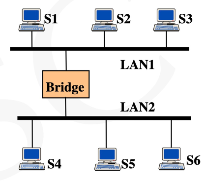
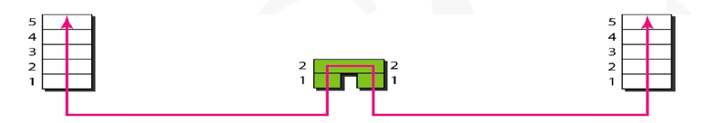
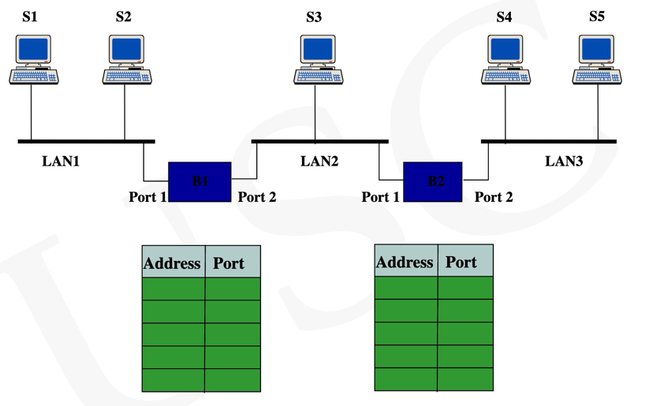
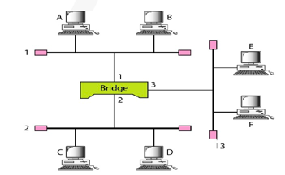

# Connecting Devices

## 连接设备
连接设备包括第一层设备（集线器），第二层设备（网桥），第三层设备（路由器）
以及具有5层的网关。

## Passive Hubs(无源集线器)
无源集线器 是一个连接器，它连接来自不同分支的电线。在模型的位置中低于物理层。

## Hub and Repeater（集线器和中继器）
中继器的功能是再生信号，扩大网络覆盖范围。

## Collision Domain and Broadcast Domain（冲突域和广播域）

冲突域定义为一组竞争访问信道的节点。

广播域定义为一组接收广播传输的节点。

中继器和集线器既不能隔离广播域也不能隔离冲突域。

## Bridge in General：桥梁概况

必须解决： MAC的不同形式，信息率，缓存，最大帧长度的不同。

## Transparent Bridge：透明桥

桥通常被用于连接相同类型的网络，例如以太网与以太网，或者无线与无线。此类网桥被称为
透明桥。透明桥不会引入大的延迟，因为不需要帧转换，被称为透明的原因就是主机不知道网桥的存在

### 桥接器
桥接器中的物理层分离意味两侧的物理层可以不同，一侧可以是电缆，一侧可以是光纤，
但是两侧的第二层小童，并且都使用相同的MAC程序。与路由器不同，网桥不会更改帧中
的物理地址。

## Bridge-Table
删除网桥后，会存在三个网络，三个广播域和三个冲突域。三个网络意味着他们的网络地址也不同。

使用网桥时，只有一个网络和广播域。网桥比集线器更具有优势。网桥有一个MAC地址网桥表以及他们各自
的网段号。

## 网桥的操作：

A想要发送给F，A先发送给B，然后B drop掉，Bridge检测到F唯一端口3，于是转发到端口3，并且
过滤掉端口2的内容。
桥接器需要位每个端口准备缓冲区，检查帧时候需要发送并且保留帧。

## 桥接器，1 Buffer 2 FDX support

桥接器接收整个帧，处理该帧（使用FCS进行错误检测），如果没有错误，处理器建立源端口与目标端口
的连接。

直通：当发送方传输帧时，桥接器不会等待整个帧，而是在收到报头后立马检查连接。
这意味着处理器不处理帧，而是由目标节点进行检查，意味着直通速度更快。

## 桥接器和路由器：
储存和转发设备：路由器是三层交换机（网络层设备，检查网络层报头），维护路由表，实施路由算法

网桥或二层交换机是链路层设备，维护交换表，实施过滤，学习算法

## Gateway 网关

网关称为协议转换器，可以在任何层运行，工作比路由器交换机复杂的多，
通常是五层设备。

## Backbone network 主干网

主干网允许多个LAN，没有站点直连主干网，站点是LAN的一部分，主干网连接LAN
