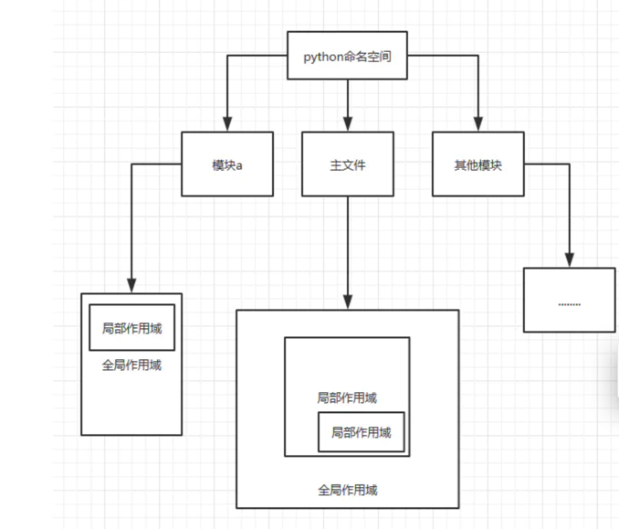

### 1 解释性语言和编译型语言的区别
解释性语言：把源程序翻译一句，执行一句，直到结束。 例如python

编译型语言：把源程序全部编译为二进制的可运行程序，然后直接运行。如C，cpp

### 2. python中的数据结构
1. 字符串：引号包含的任意文本
2. 列表：有序集合，可以添加和删除元素
3. 元组：有序集合，元组中的数字无法修改，即不可变
4. 字典：无序集合，由键值对组成。
5. 集合：是一组key的集合，每个元素都唯一

### 3.上述类型的常用方法：
1. 字符串：
   1. 切片
   2. join：可以用来连接字符串 ，将字符串，元组，列表中的元素以指定的字符连接
   3. replace(old,new,count):将字符串old换成new
   4. split():默认以空格进行分割

2. 列表：
   1. 切片，同字符串
   2. append：直接添加，哪怕是列表也会加入进入。
      extend：在当前列表的前提下，扩展列表的元素
   3. 删除：del:根据下标
            pop：删除最后一个
            remove：根据值删除
   4. sort排序：默认由小到大，参数reverse改为True可改为由大到小
   5. reverse：列表倒置

3. 字典：
   1. 清空：clear
   2. pop('key):清除一个key
   3. 遍历：【key for key in dict2],
            [value for value in dict2.values()],
            [(k,v)) for k,v in dict2.items()]
   4. fromkeys 用于创建一个新的字典，以序列中元素作为字典的建，value为字典中建对应的初始值

### 4.python中的字符串编码
Unicode编码把所有的语言都编码到一套编码系统中，在python中可以用encode()的方法
进行编码，也可以用decode()来吧bytes编码成字符串。

    bytes = '您好'.encode('utf-8')
    str = bytes.decode('utf-8')

### 5.一行实现数值交换

    a，b = 1,2
    b,a = a,b

### 6.is和== 的区别：
== 是比较操作符，比较对象的值是否一致，is是判断对象之间的身份(内存地址)是否相同，可以用
id()的方法查看内存地址。

    a = [1,2]
    pring(id(a))

### 7.python函数中的参数类型
位置参数，默认参数，可变参数，关键字参数
        
    def example_function(positional, default="default value", *args, **kwargs):
        print("Positional argument:", positional)
        print("Default argument:", default)
        print("Variable length positional arguments (args):", args)
        print("Keyword arguments (kwargs):", kwargs)
    
    # 调用示例
    example_function("positional value")
    example_function("positional value", "non-default value")
    example_function("positional value", "non-default value", 1, 2, 3)
    example_function("positional value", "non-default value", 1, 2, 3, key1="value1", key2="value2")
    
### 8.*arg 和 ** kwarg

    def ekke(*args, **kwargs):
    if args:
        print("args:",args)
    if kwargs:
        print("kwargs:",kwargs)
    ekke(1,2,3,key = '222')

    args: (1, 2, 3)
    kwargs: {'key': '222'}

*arg 会把位置参数转变为tuple，*kwarg会把关键字参数转为dict

### 9.获取当前时间

    import time
    import datetime
    
    print(datetime.datetime.now())
    print(time.strftime("%Y-%m-%d"))

### 10.PEP8规范
1. 尽量避免使用小写字母l，大写字母O，以及大写字母I等容易混淆的字母
2. 函数命名使用全部小写的方式
3. 变量命名使用全部大写的方式
4. 使用has 或者 is 命名布尔元素
5. 不要使用反斜杠连接行
6. 方法定义之间空一行，顶级定义之间空两行
7. 如果一个类不能继承其他类，就从object中继承。
8. 内部使用的类，方法，变量前加前缀_ 表明

### 11.python的深浅拷贝
1. 浅拷贝:只成功拷贝了列表的外城，列表内层的列表还是共享的
    
        import copy
        list1 = [1,2,3,[1,2,'a']]
        
        list2 = copy.copy(list1)
        list2.append('a')
        list2[3].append('a')
        print(list1)
        print(list2)

2. 深拷贝:两个列表完全独立开来，一个列表的操作不会影响另外一个

        import copy
        list1 = [1,2,3,[1,2,'a']]
        list2 = copy.deepcopy(list1)
        list2.append('a')
        list2[3].append('a')
        print(list1)
        print(list2)

### 12.【lambda x:i*x for i in rnage(4)]
由于闭包的特性，闭包会延迟对外部函数变量的求值，直到内部函数被调用。这也是为什么在循环中创建闭包时，所有闭包引用的都是循环变量的最终值。
这4个lambda函数都会引用 i 的最终值。由于 range(4) 的最后一个值是3，所以每个lambda函数的 i 都是3,
结果为【3，3，3，3】

问题解决：

      def num():
          return [lambda x,i=i: i*x for i in range(4)]
      a = [m(1) for m in num()]
      print(a)

### 13 九九乘法表：print函数会默认换行
      for i in range(10):
          for j in range(1,i+1):
              print(f"{i}*{j} = {i*j}",end= ' ')
          print()

### 14.filter,map,reduce的作用：
1. filter函数用于过滤序列，它接收一个函数和一个序列，把函数作用在序列上，根据返回值的True，False来判断是否保留元素。

      list1 = [i for i in range(10)]
      list2 = list(filter(lambda x:x%2 == 1,list1))
      print(list2)
2. map函数传入一个函数和一个序列，把函数作用到序列上的每一个元素，并且返回一个可迭代的对象。
   

      list1 = [i for i in range(10)]
      list2 = list(map(lambda x:x%2,list1))
      print(list2)
3. reduce用于递归计算，同样传入一个函数和一个序列，并把函数与序列的计算结果与下一个元素计算。
   

      from functools import reduce
      a = reduce(lambda x,y:x+y,range(101))
      print(a)
      
      from functools import reduce
      a = reduce(lambda x,y:y if x<y else x,[1,2,3,4])
      print(a)
   
      from functools import reduce
      a = reduce(lambda x,y:x*10+y,[3,4,5,6])
      print(a)

### 15.为什么不建议函数的默认参数传入可变的对象

      def test(L=[]):
         L.append('test')
         print(L)

### 16.__new__ 和 __init__ 的区别：
__new__ 是在创建实例之前就被调用，因为它的任务就是创建实例然后返回该实例对象，是个静态方法。

__init__是当实例对象创建完成后被调用，然后设置对象属性的一些初始值，通常在初始化的时候实用，是一个实例方法。

### 17.三元运算的规则：
      a ,b = 2,4
      h = a-b if a>b else b-a
### 18.生成随机数字
      import numpy as np
      a = np.random.randint(0,100,20)
      b = np.random.random()
### 19.zip的用法：
zip函数将可迭代的对象作为参数，然后将对象中对应的元素打包成一个元组，然后返回这个元组

      list1 = ['a', 'b', 'c', 'd']
      list2 = [2,3,4,5]
      tuppppple = list(zip(list1,list2))
      print(tuppppple)

### 20.range 和xrange的区别
xrange只在python2中才有，python中为range(start,stop(not include),step)

### 21.with方法打开文件的作用
打开文件进行读写的时候可能出现异常情况，如果按照f.open()的方法需要try和except来
进行异常判断，并且不管遇到什么情况都要f.close()。with方法帮助我们实现f.close（

      
      with open('hello.txt','a') as f:
         f.write('hello')

### 22.字符串转列表
      s = '1,2,3,4,5,6,7,8,9'
      s.split(',')
      print(s.split(','))

### 23.字符串转整数
      s = '1,2,3,4,5,6,7,8,9'
      print(list(map(lambda x: int(x), s.split(','))))

### 24.去重
      mylist = [12,3,4,4,3,4]
      print(list(set(mylist)))
### 25.字符串统计单词个数
      from collections import Counter
      my_str = 'wkerernfdjaksfjekjdf'
      dict = Counter(my_str)
      print(dict)
统计字符串中的单词个数

      my_str = 'hello world this is jim'
      print(my_str.split(' '))
      >>>> ['hello', 'world', 'this', 'is', 'jim']
### 26.列表推导，求奇偶数
      print([x for x in range(20) if x%2 == 0])

### 27.一行代码展开列表
      list1 = [[2,3],[34,4,4],[3,2,2]]
      print([j for i in list1 for j in i])
      >>> [2, 3, 34, 4, 4, 3, 2, 2]

### 28.二分法查找函数
      a = [1,4,5,6,7]
      def binart_search(list,x):
          left = 0
          right = len(list)-1
          while left < right:
              mid = (left + right) // 2
              if x == list[mid]:
                  return mid
              if x < list[mid]:
                  right = mid-1
              else:
                  left = mid+1
          return -1
      
### 29.合并两个元组到字典
      a = ['zhangfei','aaaa']
      b = [66,80]
      print(dict(zip(a, b)))

### 30.元祖的不可修改以及list的可变
元组的不可修改

      >>> a = (1, 2, 3, [4, 5, 6, 7], 8)
      >>> a[3] = 2
list的可变

      >>>a = (1, 2, 3, [4, 5, 6, 7], 8)
      >>> a[3][2] = 2

### 31.字典和json的转换
      import json
      a = ['zhangfei','aaaa']
      b = [66,80]
      c = dict(zip(a, b))
      myjson = json.dumps(c)
      mydict = json.loads(myjson)

### 32.列表推导式，字典推导式，生成器
      
      td_list = [i for i in range(10)]
      print(td_list)
      
      ge_list = (i for i in range(10))
      print(ge_list)
      print(ge_list.__next__())

生成器是python中的一种特殊函数，它允许在在迭代过程中逐步生成值，可以看作一种
迭代器，可以有效处理大量数据或无限数据流。
特性：
1. 惰性求值：生成器在每次迭代生成一个值，而不是一次性生成所有值。
2. 节省内存：生成器不会一次性将所有值储存在内存中，而是按需生成。
3. 状态记忆：在yield语句处暂停，并记住当前的执行状态。
      

      def my_generator(n):
         for i in range(n):
            yield i

      # 使用生成器
      gen = my_generator(5)
      for value in gen:
          print(value)

### 33.read，readline，readlines：
read：读取整个文件。

readline：读取下一行，使用生成器方法。

readlines：读取整个文件到一个迭代器供我们遍历。

### 34.打乱列表
      import  random
      list  = list(i for i in range(10))
      random.shuffle(list)
      print(list)
### 35.反转字符串，列表
      s = 'eerkjijef'
      print(s[::-1])
      l = [2,3,4,1,5]
      print(l[::-1])

### 36.单下划线和双下划线的作用：
__foo__ :一种约定，python内部的名字，区别于其他自定义的命名。

_foo: 用来指定变量私有，不能导入。

__foo:有真正的意义，解析器用_classname__foo来代替这个名字，不能像公有成员
一样随便访问，通过对象名._类名__foo来访问。

### 37.继承的特点：
- 同时支持单继承和多继承：一个父类为单继承，多个父类为多继承。
- 子类会继承父类的属性和方法，子类也会覆盖父类同名的变量和方法。
- 在父类的__init__方法不会被自动调用，它需要在子类的定义中显示调用
   
   
      class BaseClass:
         def __init__(self, base_value):
              self.base_value = base_value
              print(f"BaseClass initialized with base_value: {self.base_value}")

      class DerivedClass(BaseClass):
          def __init__(self, base_value, derived_value):
              # 显式调用基类的构造方法
              super().__init__(base_value)
              self.derived_value = derived_value
              print(f"DerivedClass initialized with derived_value: {self.derived_value}")
      
      # 创建 DerivedClass 的实例
      obj = DerivedClass(10, 20)
- 在调用父类的方法时，要加上父类的类名前缀，且需要带上self参数变量，在类中调用普通函数时，不需要
self。
      
      class ParentClass:
       def __init__(self, value):
           self.value = value
   
       def parent_method(self):
           print(f"Parent method called, value: {self.value}")
   
       def another_parent_method(self):
           print("Another parent method called")

      class ChildClass(ParentClass):
          def __init__(self, value, extra_value):
              super().__init__(value)  # 调用父类的构造方法，初始化父类部分
              self.extra_value = extra_value

          def child_method(self):
              # 调用父类的方法，显式传递 self
              ParentClass.parent_method(self)
              
              # 调用父类的另一个方法，也需要传递 self
              ParentClass.another_parent_method(self)
              
              # 调用类中的另一个方法，使用 self 不需要显式传递 self 参数
              self.another_child_method()
      
          def another_child_method(self):
              print(f"Child method called, extra value: {self.extra_value}")
            
      # 创建子类实例
      child = ChildClass(10, 20)
      child.child_method()

### 38.super函数的作用
super函数是用于调用父类的一个方法.
   
      
      class A():
          def funcA(self):
              print("this is func A")

      class B(A):
          def funcA_in_B(self):
              super().funcA()

          def funcC(self):
              print("this is func C")
      
      ins = B()
      ins.funcA_in_B()
      ins.funcA()

### 39.类中的函数
主要分为实例方法，类方法，静态方法。
1. 实例方法：
- 定义：第一个参数必须是实例对象，该参数一般命名为self，通过它来传递实例的 属性和方法。
- 调用：只能由实例对象调用

2. 类方法：
- 定义：使用装饰器@classmethod。第一个参数必须是当前类对象，一般命名为cls，通过它来传递
类的属性和方法。
- 调用：实例对象和类对象都可以调用

类方法是将类本身作为对象进行操作的方法。它和静态方法的区别在于：不管这个方式是从实例调用还是从类调用，它都用把
第一个参数把类传递进来。

3. 静态方法：
- 定义：使用装饰器@staticmethod。参数随意，但是方法中不能使用任何类或者实例的任何属性。
- 调用：实例对象和类对象都可以调用

静态方法是类中的函数，不需要实例。静态方法主要用来存放逻辑性的代码，主要是一些逻辑属于类，但是和类
本身没有交互，即在静态方法中，不会涉及到类中的方法和属性的操作，可以理解为将静态方法存在此类的名称空间中。

    class ExampleClass:
        class_variable = "This is a class variable"
    
        def __init__(self, instance_variable):
            self.instance_variable = instance_variable
    
        # 实例方法
        def instance_method(self):
            return f"This is an instance method. Instance variable: {self.instance_variable}"
    
        # 类方法
        @classmethod
        def class_method(cls):
            return f"This is a class method. Class variable: {cls.class_variable}"
    
        # 静态方法
        @staticmethod
        def static_method():
            return "This is a static method. It doesn't have access to class or instance variables."

### 40.如何判断是函数还是方法
函数：与类和实例无绑定关系的称为函数。

方法：与类和实例有绑定关系的称为方法。

### 41.isinstance 和 type的区别：
type()： 不会认为子类是父类的类型，不考虑继承关系

isinstance：认为子类是父类的类型，考虑继承关系

### 42.查看目录下所有文件：
        import os
        print(os.listdir('.'))

### 43.计算由1到5互步重复的三位数
        for i in range(6):
            for j in range(6):
                for k in range(6):
                    if i != j and i != k and j != k:
                        print(f"{i}{j}{k}")

### 44.去除字符串首位的空格
        s = '   2333   '
        print(s.strip())

### 45.去除字符串中间的空格：
方法一：

        s = "hello world"
        print(s.replace(" ", ""))
方法二：
        
        s = "hello world"
        print(''.join(s.split(" ")))

## 46.字符串格式化的方式
方法一：
        
        print("This is %s" %"python")
        print("This is %s ,%s" %("me","python test"))
方法二：

        print("This is {}".format("python"))
        print("This is {name}".format(name = "python"))
方法三：    
        
        name = "python"
        print(f"This is {name}")

### 47."hello world" 转换为大写：
        name = "hello world"
        print(name.title())

### 48.整数转字符串
        a = [1,2,3,4,5]
        b = list(map(lambda x:str(x),a))
        print(b)

### 49. 反射
反射是通过字符串的形式，导入模块，去模块寻找指定的函数并执行。利用字符串的形式去对象(模块)中操作
成员，是一种基于字符串的事件驱动。

        
    class NewClass(object):
        def __init__(self,name,age):
            self.name = name
            self.age = age
    
        def myname(self):
            print(f"my name is {self.name}")
    
        def myage(self):
            print(f"my age is {self.age}")
        
        people = NewClass('Jack',20)
        
        print(hasattr(people, 'name'))
        print(getattr(people, 'age'))
        setattr(people, 'name','Bob')
        delattr(people, 'name')

getattr,setattr,delattr,hasattr 都在内存中进行，不会影响文件的真实内容

### 50.metaclass 元类
类与实例：首先定义类以后，就可以根据类来创建出实例，所以先定义类，然后创建实例。

类与元类：先定义元类，根据metaclass创建出类，所以先定义元类，然后创建类。

### 51.sorted 和 sort的区别
list的sorted和sort函数，都有两个可选的关键字参数。

- reverse：如果设定为True，会降序输出，默认是False

- key：会被用在序列的每一个元素上

### 52.Python中的GIL
GIL是python中的全局解释器锁，同一进程中如果由多个线程，一个线程在运行python会占用
解释器(加一把锁),该进程中的其他线程便无法运行。 在多线程中，线程的运行是有先后顺序的，并不是同时进行的。

### 53.输出原始字符串
    print("hello\nworld")
    print(b'hello\nworld')
    print(r'hello\nworld')

### 54.any和all
all：如果存在啊0，None，False，则返回True。
any：如果都是0，None，False，返回True。

### 55.反转整数
    def reverse_int(x):
        if not isinstance(x,int):
            return -1
        elif -10 < x < 10:
            return x
        elif x < -10:
            x = abs(x)
            str_x = str(x)
            x = int(str_x[::-1])
            return -x
        elif x > 10:
            str_x = str(x)
            x = int(str_x[::-1])
            return x
### 56.函数式编程
纯粹的函数式编程语言编写的函数没有变量，因此，任意一个函数，主要输入是确定的，输出也是确定的，这种纯函数称之为没有副作用。
允许使用变量的程序设计语言，内部的变量状态是不确定的，同样的输入，可能是不同的输出，这种函数有副作用。python允许使用变量，因此不是纯
函数式编程语言。

函数式编程的特点：允许把函数本身作为一个参数传入另一个函数，并且允许返回一个函数。

    def sum(*args):
        def inner_sum():
            temp = 0
            for i in args:
                temp += i
            return temp
        return inner_sum
    
    
    my_sum = sum(23,4,2)
    
    print(type(my_sum))
    print(my_sum())

### 57.闭包
闭包的特点：
1. 必须有一个内嵌函数
2. 内嵌函数必须引用外部函数的变量
3. 外部函数的返回值必须是内嵌函数

### 58.装饰器
装饰器是一种特殊的闭包，就是在闭包的基础上传递一个函数，然后覆盖原来函数的执行入口。

1. 增强函数的功能：装饰器可以在函数的执行之前或执行之后执行额外的代码，比如日志记录，权限验证。
2. 代码复用：可以把常见的功能抽象到装饰器中，多个函数使用同一个装饰器，减少代码量。
3. 分离关注点：使得核心的业务逻辑与辅助功能分离，提高代码的维护性。

    def my_decorator(func):
        def decorator(*args, **kwargs):
            print("Something called before using decorator")
            result = func(*args, **kwargs)
            print("Something called after using decorator")
            return result
        return decorator
    
    
    @my_decorator
    def hello(a,b):
        print(a+b)

### 59.正则切分字符串
参数：用(r""表示，切分的标志用｜隔开)

    import re
    
    str1 = "hello world:luobo,dazahui"
    result = re.split(r":|,",str1)
    print(result)

### 60.yield的用法：
yield 是用来生成迭代器的语法，在函数中，如果包含了yield，那么这个函数就是一个迭代器
当执行到yield时，就会中断执行，直到下一次调用next时。

### 61.冒泡排序：
    def Bubble(data,reverse = False):
        for i in range(len(data)-1):
            current_min  = data[i]
            for j in range(i+1,len(data)):
                if current_min > data[j]:
                    current_min = data[j]
                    min_index = j
            temp = data[i]
            data[i] = current_min
            data[min_index] = temp
        return data

### 62.json判断数据
    import json
    file_text2 = '{"name":"john","age":22,"sex":"woman","address":"USA"}'
    file_text1 = '{"name":"john","age":22,"sex":"man","address":"USA"}'
    
    dict1 = json.loads(file_text1)
    dict2 = json.loads(file_text2)
    
    for s1,s2 in zip(sorted(dict1),sorted(dict2)):
        if dict1[s1] == dict2[s2]:pass
        else:
            print(0)

### 63.enumerate的用法
enumerate是python的一个内置函数，用于将一个可遍历的数据对象，组合为一个索引序列
同时列出数据和数据下标。

其中c为下标，i为数据
    list1 = ['2','3','4']
    for c,i in enumerate(list1):
        print(c,i)

### 64.简述继承
1. 单继承：一个子类继承单个基类
2. 多重继承：一个子类继承多个基类
3. 多级继承：一个子类继承一个基类，而基类继承另一个基类
4. 分层继承： 多个子类继承一个基类

### 65.// % ** 运算符
//： 返回结果的整数部分，向下取整
%： 取谟符号，返回除法后的余数。
** ： 2**3 = 8

### 66.tuple 和list转换
    tuple = (1,23,45,1)
    list1 = list(tuple)
    print(list1,type(list1))

### 67.断言
就是一个检测条件，如果条件为真，它什么都不做，反之抛出一个带可选错误的信息。

### 68.python的内存问题
退出后，内存是否会全部释放？

不会，具有对象循环引用或者全局命名空间引用的变量，不会被释放。

### 69.统计字符串中字符出现的次数
    from collections import Counter
    str = 'nihasenidenrakrkerer'
    print(Counter(str))

### 70.字符串中数字的替换
使用re正则替换

    import re
    str1 = "我是周萝卜，今年18岁"
    res = re.sub(r"\d+","30",str1)
    print(res)

### 71.list空索引的问题
list = ['a','b','c','d']
print(list[10:])

尝试获取列表的切片，开始的index超过了成员个数不会产生IndexError，而是仅仅返回一个空列表。

