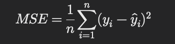
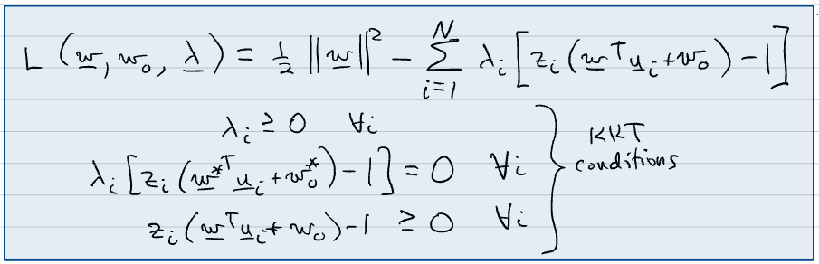
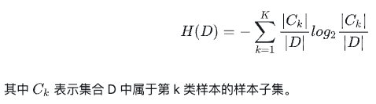

~~# 面试常用问题总结

# 1. 基本概念相关问题
## 1.1 机器学习问题的基本流程
1. 确定问题：有监督还是无监督，分类还是回归问题
   - 有监督问题：数据中存在标签，即有y值
   - 无监督问题：数据中不存在标签，没有y值
2. 数据的收集与处理
   - 缺失值处理：均值代替，删除行等
3. 特征工程
   - 特征构建，特征的选择，特征的组合等
4. 模型训练
   - 调参、评估模型
5. 模型部署
   - 线上运行的效果如何等
## 1.2 损失函数的概念
损失函数是指单个样本的预测值与实际值的差值，用于计算的函数被称为损失函数。
#### 分类与回归常用的损失函数
- 回归模型常用：
1. 均方误差(MSE):

MSE是最常用的回归损失函数，计算预测值与真值的平方和，平方差可以放大大误差的影响，使得模型更关注大的误差。
2. 均方根误差(RMSE):

RMSE是MSE的平方根，保持了MSE的特性。

3. 平均绝对误差

与 MSE 不同的是，MAE 对大误差的敏感度较低。

4. 均方对数误差(MSLE)

MSLE 更关注相对误差，适用于目标值具有指数增长特性的情况。

5. Huber损失

Huber结合了MSE以及MAE的优点，使得小误差使用平方损失，大误差使用绝对损失，对异常具有鲁棒性。
鲁棒性（Robustness）是指系统、模型、算法或方法在面对各种不确定性、误差或变化时仍能保持其性能和稳定性的能力。

- 分类模型常用的损失函数：
1. 交叉熵损失
   - 二分类交叉熵损失：

   

   其中y_i是真实标签，y^_i为预测概率
   - 多分类交叉熵损失：

   

   交叉熵损失在误差较大时候呈现较大的损失值（指数形式）
2. 0-1损失：
预测正确为1，错误为0。

## 1.3 结构误差与经验误差
经验风险(经验损失):模型在训练数据集的平均损失。

结构风险：在经验风险上加上表示模型复杂度的正则化项。结构风险最小化等驾驭正则化，其
策略认为结构风险最小的模型就是最优的模型。

## 1.4 常用的评价指标：
TP：样本是正类，模型分为正类。

FP：样本是负类，模型分为正类。

TN：样本是负类，模型分为负类。

FN：样本是正类，模型分为负类。

- 准确率(Accuracy):分类正确的样本数占总样本的比率。

   Accuracy = (TP+TN)/(TP+TN+FP+FN)
   
   缺点：单类样本占比很大的时候导致模型准确率不准确。
   
   解决：计算每个类的准确率，再计算平均准确率来评估。

- 精确率(Precision):分类正确的正样本个数占分类起判定为正样本个数的比率。

   Precision = TP/(TP+FP)
- 召回率(Recall):分类正确的正样本个数占真正的正样本个数的比率。

   Recall = TP/(TP+FN)
- F1-score
   
   F1-score = 2*(Precision*Recall) / (Precision + Recall)

   优点：同时考虑了Precision和Recall，适用于类别补平衡的的数据集
   
   缺点：不易解释，对样本分布的变化比较敏感
- ROC & AUG
   - ROC：横坐标为FPR(假阳性率)，纵坐标为TPR(真阳性率)。
   - 【如何绘制ROC曲线】通过不断移动分类器的“截断点”来生成曲线上的一组关键点。在二分类问题中，模型输出一般是预测样本为正例的概率，在输出最终的正例负例之前，我们需要制定一个阈值。大于该阈值的样本判定为正例，小于该阈值的样本判定为负例。通过动态调整截断点，绘制每个截断点对应位置，再连接所有点得到最终的ROC曲线。

   -AUG：ROC曲线下边的积分，一般取值为0.5-1，AUG越大分类性能越好。

- 混淆矩阵
   混淆矩阵又称为误差矩阵。
   
## 1.5 模型的过拟合和欠拟合
- 过拟合：模型在训练集上表现的效果很好，但是在测试集上的效果不佳。
   - 解决方法：
  1. 增加样本个数：对于神将网络来说使用数据增强。
  2. 简化模型：神经网络使用Dropout，Early Stopping的方法
  3. 决策树的剪纸，限制决策树的宽度。

- 欠拟合：准确率过低，小于0.8。
   - 解决方法：
  1. 增加特征，多项式化增加特征
  2. 提高模型的复杂度，神经网络提高神经元个数，增加层数，SVM使用核函数。
  3. 减小正则化处罚系数。

## 1.6 超参数的选择方法以及优缺点
- 网格搜索法：查找搜索范围内的所有点来确定最优值。先用较大的搜索范围和较大的步长，
在用小范围和小步长，寻找准确位置。
   - 优点：简单，大概率找到全局最优解
   - 缺点：耗时，目标函数非凸时，会错过全局最优解。

- 随机搜索：在搜索范围内随机选择超参数，样本点足够大的前提下，大概率能找到全局最优解。
   - 优点：更快
   - 缺点：可能会错过全局最优解

- 贝叶斯优化算法：对目标函数的形状进行学习，然后找到全局最优的参数。
   - 优点：贝叶斯算法充分利用了之前的信息。
   - 缺点：可能会陷入局部最优。

## 1.7 关于偏差和方差：
- 误差分析中：
   - 大偏差(训练误差高)：模型欠拟合。
   - 小偏差(训练误差低)，大方差(测试误差高):模型过拟合
   - 小偏差(训练误差低)，小方差(测试误差低):较为理想的模型
   - 大偏差(训练误差高)，大方差(测试误差高)，模型较差。

其中：模型复杂度升高时，偏差变小，方差变大。反之相反，中间灰线表示模型刚刚好。

## 1.8 奥卡姆剃刀定律：
奥卡姆剃刀定律：若有多个假设与观察一致，则选最简单的那个

奥卡姆剃刀原理应用于模型选择时变为以下想法：在所有可能选择的模型中，能够很好地解释已知数据并且十分简单才是最好的，也就是应该选择的模型。

# 2 特征工程
## 2.1 缺失值和异常值的处理
- 缺失值较多的特征点，将缺失值的特征直接舍弃掉
- 缺失值较少的特征(10%以内)：
  1. 直接把NaN当作特征来处理
  2. 用均值来填充(连续特征-均值，离散特征-众数)

## 2.2 归一化处理(Normalization)
位了消除特征值量纲带来的数值差异，对特征值进行归一化处理。
常用的归一化处理方法：
- 线性函数归一化：对原始函数进行线性归一化(从0-1)或者(-1-1)
- 零均值归一化：将原始数据映射到均值为0，标准差为1的分布上。

注：那些模型不用使用归一化？

概率模型不需要使用归一化，因为概率模型只关心变量分布的占比，而不关心数值。

## 2.3 标准化和正则化：(Normalization & Regularization)
标准化:标准化的目的是消除不同特征之间量纲的影响，使得数值不同的特征不会在训练中造成太大的影响。

正则化：通过增加惩罚系数来约束模型的复杂度，避免模型的过拟合。

# 3.KNN(K Near Neighbor)K近邻算法详解：

## 3.1 算法定义：
KNN属于(监督学习)算法的(分类)算法,计算样本点到达每个点的距离来作为相似度的反馈。KNN属于基于实例的学习方法
属于懒惰学习，没有显式学习过程

## 3.2 算法步骤：
### 3.2.1 选择参数K：
参数K是一个正整数，表示在预测时需要选择的K个邻居，K值过小，会使得算法过拟合，K值过大会使得算法欠拟合。

### 3.2.2 计算距离：
1. 通常使用欧式距离作为度量方法：

2. 曼哈顿距离(Manhattan Distance)

3. 闵可夫斯基距离(Minkowski Distance):

4. 切比雪夫距离(Chebyshev Distance):

### 3.2.3 分类与回归
- 对于分类任务：通过周围K个样本的类别来表示预测样本的类别
- 对于回归任务：通过周围K个样本的均值，或者加权均值类预测样本的y值

## 3.3 优缺点：
- 优点：
   - 1. 简单易懂
   - 2. 无参数模型，不需要额外的储存空间
   - 3. 适用于多分类任务
- 缺点：
   - 1. 计算复杂度过高
   - 2. 内存消耗大
   - 3. 对噪声过于敏感
## 3.4 实际使用
代码参考KNN_Example

# 4 SVM(支持向量机)详解：
## 4.1 算法定义：
支持向量机是在多维空间中找到的最大间隔超平面的(分类)算法，属于(监督学习)算法。找到间隔最大的超平面使其区别与感知机模型；
支持向量机还包含了核技巧，使它成为了实质上的非线性分类器。其策略是间隔最大化，可形式化的求解凸二次规划问题。

## 4.2 算法步骤
### 4.2.1 拉格朗日对偶问题：
在不等式约束优化时，引入松弛变量，转为等式约束优化。在进行等式约束优化的同时，引入拉格朗日乘子，可将等式约束优化转为
无约束优化。

不等式约束优化 ------》引入松弛变量 ----》等式约束优化。

等式约束优化  ------》引入拉格朗日乘子 ------》无约束优化。

引入拉格朗日优化以后：

转为拉格朗日对偶形式：

## 4.3 引入松弛变量和铰链损失的问题
### 4.3.1 松弛变量的引入

### 4.3.2 铰链损失的定义

### 4.3.3 引入松弛变量和铰链损失后的函数为

## 4.4 核函数的使用
核函数的主要作用是将低维空间中的数据映射到高维空间，使得在高维空间中，线性不可分的数据变得线性可分，从而能够应用线性分类器进行分类。核函数通过内积运算来实现这种映射，而不需要显式地计算高维空间中的坐标，称为“核技巧”（Kernel Trick）
### 4.4.1 核函数的分类
- 线性核函数：主要用于线性可分的情况

- 多项式核函数：实现将低纬空间映射到高纬空间，核矩阵的元素之将趋近于无穷大或者无穷小，计算复杂到会大到无法计算。

- 高斯核(径向基函数核)RBF：实现低纬度到高纬度的映射，并且参数较多项式核函数要小，大多数优先使用高斯核。

### 4.4.2 为什么引入核函数？
因为低纬空间映射到高纬空间后，纬度可能会很大，如果计算内积，会非常难以计算，
引入和函数，两个点在空间的内积可以直接表示为核函数的计算。

## 4.5 SVM算法的优缺点
- 优点：
  1. 不依靠统计方法，能够找到关键样本
  2. 采用核技巧，可以处理非线性的分类/回归任务
  3. 计算的复杂性只取决于支持向量的数目，而不是样本空间的纬度，避免了纬度灾难

- 缺点：
  1. 训练时间长，参数复杂
  2. 采用核技巧，需要储存核矩阵，空间复杂度大
  3. 只适合小批量的样本，不适合大样本
  4. 涉及到距离的度量，缺失值就变得很重要。
    常用的缺失值处理方法：
    - 把数值型变量的缺失值用对应类别的中位数替换
    - 把缺失值当作新的数值
    - 忽略该特征(当缺失较为少时)

## 4.6.实际应用：
参考SVM_Example

# 5 朴素贝叶斯模型详解：
## 5.1 算法思想：
贝叶斯算法是基于统计学的一种概率分类方法，根据贝叶斯先验概率计算出后验概率，然后根据概率最大的
后验概率来选择类。
贝叶斯假设：
  - 特征之间互相独立
  - 每个特征都同等重要

### 5.1.1 条件概率与联合概率的关系

## 5.2 算法思想：

## 5.3 分类：
### 5.3.1 高斯朴素贝叶斯：
高斯NB是先验为高斯分布(正态分布)的朴素贝叶斯，假设每个标签的数据都服从高斯分布，
正态分布的概率密度函数为：

### 5.3.2 多项式朴素贝叶斯：
多项式朴素贝叶斯是先验为多项式分布的朴素贝叶斯，它假设特征是由一个简单多项式分布生成的，
多项式分布可以描述各种样本出现的次数，常用于：文本分类，特征表示的是次数(例如某个词语出现的次数)。

### 5.3.3 伯努利贝叶斯：
伯努利贝叶斯就是先验概率为伯努利分布的朴素贝叶斯，假设特征的先验概率是二元伯努利分布，在文本分类中表示一个
特征有没有在文档中出现过。

### 5.3.4 分类总结：
- 如果特征分布大部分是连续值(如人的身高，体重),高斯贝叶斯较为合适。
- 如果特征大部分是多元离散值(如文档分类中特征是单词出现的次数)，多项式伯努利较为合适。
- 如果特征大部分是二元离散值(如文档分类中出现的特征是单词是否出现)，使用伯努利贝叶斯会较为合适。

## 5.4 优缺点：
- 优点：
    1. 在属性相关性较小的时候效果好
    2. 可以处理多分类问题时
    3. 算法逻辑简单
- 缺点：
    1. 无法实用相关性较大的特征

# 6 回归算法
1. 线性回归
2. 逻辑回归
3. 多项式回归
4. 逐步回归
5. 岭回归
6. 套索回归
7. 弹性网回归
## 6.1 算法思想：
### 6.1.1 线性回归
线性回归时机器学习中最常见的监督回归模型，给定一些样本值(X,y)，然后在测试样本(X1)下计算出
y值。

### 6.1.2 算法步骤：
1. 使用最小二乘法计算出最小的损失
2. 利用伪逆矩阵来求解W和b

### 6.1.3 算法优缺点
- 优点：
    1. 思想简单，建模迅速
- 缺点：
    1. 对于非线性数据难以建模

### 6.2.1 逻辑回归：
逻辑回归时机器学习中的监督分类模型，主要解决2分类问题。

### 6.2.3 算法步骤：

# 7.决策树
## 7.1 基本树(包括ID3，C4.5，CART)
### 7.1.1 ID3 决策树
ID3 是建立在奥卡姆剃刀的基础上，越是小型的决策树，越要优于大的决策树。

#### 思想：
以信息增益来度量特征选择，选择信息增益大的特征进行分裂，采用自顶向下的贪婪搜索
遍历可能的决策树空间。
1. 初始化特征集合和数据集合
2. 计算数据集合信息熵和所有特征的条件熵，选择信息增益较大的作为当前的分裂节点。
3. 更新数据和特征集合
4. 重复2-3步，直到子集包含单一特征。
#### 划分标准
信息熵：

条件熵：

信息增益 = 信息熵 - 条件熵

#### 缺点：
1. 没有剪枝策略，容易过拟合
2. 只能用于处理离散分布的特征
3. 没有考虑缺失值
#### 实际使用
参考 ./DecisionTree_Example/ID3

### 7.1.2 C4.5
C4.5算法最大的特点就是克服了ID3对特征数目的偏重这个缺点，引入了信息增益率来作为分类指标。
#### 改进：
- 引入了剪枝策略进行后剪枝
- 引入了信息增益率作为划分标准
- 将连续特征离散化
- 对于缺失值的问题
    - 在特征值缺失的情况下如何划分？
        对于特征值缺失，用没有缺失的样本子集来折算
    - 选定划分特征，对于缺失特征值的样本如何处理？
        将样本同时划分到所有的子节点去
#### 划分标准：

#### 剪枝策略：
为什么要剪？

过拟合的树泛化能力非常差

- 预剪枝：在节点划分前来确定是否继续增长，及早停止生长的方法有：
    - 节点内数据的样本低于某一阈值
    - 所有的节点特征都已经分裂
    - 划分前准确率比划分后高
  
    总结：预剪枝不仅可以降低过拟合的风险，而且可以减少训练的时间，但是会带来欠拟合的风险。

- 后剪枝：在已经生成的树上进行剪枝。
    - C4.5 采用悲观剪枝方法，用递归的方式从每个非子叶，评估用一个最佳子叶节点代替这颗子树
    是否有益来决定是否剪枝。
    
    总结：后剪枝的欠拟合风险很小，泛化性能高于预剪枝，但是训练时间过长。

#### 缺点：
- C4.5只能用于分类
- C4.5使用的熵模型耗时
- C4.5用的是多叉树，用二叉树效率更高

### 7.1.3 CART
#### 算法思路：
CART主要包括：分裂，剪枝和选择。
- 分裂：是一个二叉递归的过程，输入既可以是连续型也可以是离散型，CART没有停止准则，会一直生长下去。
- 剪枝：采用代价复杂度剪枝，从最大树开始，每次选择训练数据熵对整体性能贡献最小的那个分裂节点作为下一个剪枝对象，CART会产生一系列的嵌套剪枝树，需要选择最优的一个。
- 树选择：用单独的测试集来评估每棵剪纸树的预测性能。

#### 相较于C4.5
- CART为二叉树，运算速度快，C4.5为二叉树，运算慢
- C4.5只能用于分类，CART可以回归，可以分类
- CARt的评估指标是基尼系数，减少了大量的对数运算
- CART采用代价复杂度来剪枝，C4.5采用悲观剪纸

#### 划分标准：
基尼系数：熵模型有大量的对数运算，基尼系数不仅保留了熵模型的优点，代表了模型的不纯度，基尼系数越低，不纯度越低，特征越好，与信息增益(信息增益率)相反。

当CART在二分类的时候：

基尼系数可以理解为熵的一阶泰勒展开：

#### 缺失值处理：
1. 如何在特征值缺失的时候进行划分特征的选择？ 
- 使用惩罚机制来抑制提升值，例如：一个特征的20%是缺失的，那么这个特征就会减少20%

2. 选定该划分特征，模型对于缺失该特征值的样本如何处理？
- 每个树的节点都有代理分裂器。在代理分裂器中，特征的分值必须超过默认规则的性能才有资格作为
代理，当CART遇到缺失值的时候，就是用排名第二的代理，以此类推。

#### 剪纸策略：
采用代价复杂度的剪纸策略，生成一系列树，每个树都是通过将前边的树的某个
或者某些子树替换成一个叶节点来代替。需要使用单独的测试集来评估所有的树，选择最好的。

#### 7.1.4 三颗树的总结：
- 划分标准的差异：ID3使用信息增益偏向特征值多的特征，C4.5选择信息增益率，偏向于特征值小的特征。
CART使用基尼系数偏向于特征值多的特征
- 使用场景：ID3和C4.5都只能用于分类问题，CART用于分类和回归问题。ID3和C4.5都是多叉树，速度慢，
CART是二叉树，速度快
- 样本数据的差异：ID3只能处理离散数据却对缺失值敏感，C4.5和CART可以处理连续性数据且有多种方法处理
缺失值。从样本量来考虑：小样本建议C4.5，大样本建议CART。
- 剪纸策略的差异：ID3没有剪纸，C4.5是悲观剪纸策略来修正，CART是通过代价复杂度来剪枝

