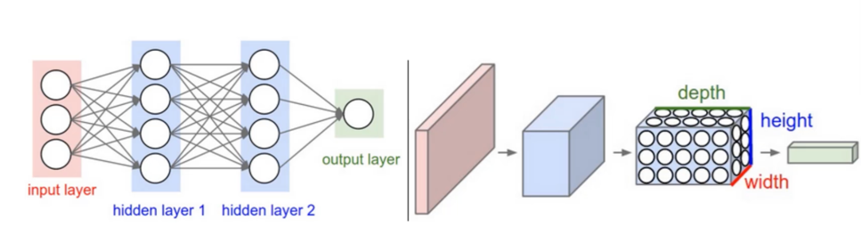
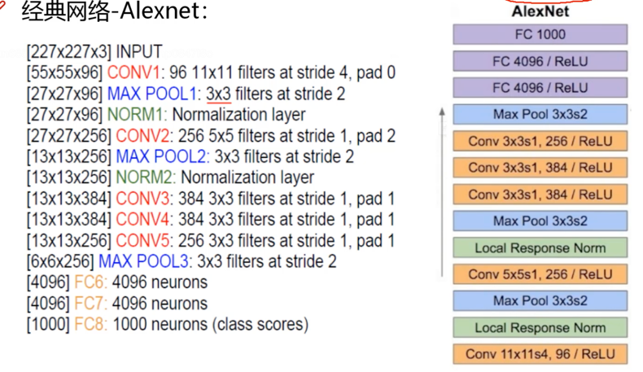
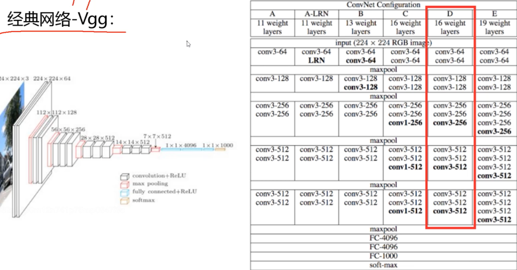
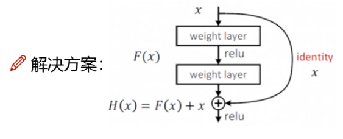

回归任务思路：
1. 读取数据
2. 数据预处理，对非数值编码进行热编码
3. 将feature和label分开
4. 归一化处理
方法一：
   1. 权重矩阵初始化
   2. 计算隐藏层，
   3. 加入激活函数
   4. 预测结果
   5. 计算损失
   6. 反向传播
   7. 更新权重参数矩阵
   8. 权重梯度清零

方法二：
   1. 设置输入输出的大小
   2. 搭建网络结构
   3. 用batch SGD进行梯度计算

# 3.卷积神经网络的网络原理与参数
## 3.1 卷积的作用
传统的神经网络的参数量大，过拟合风险较大。利用卷积神经网络，可以解决这些问题。

输入的样本变为了h * w * c，卷积的核为h * w * c，核的通道必须要与输入样本的通道相同。要用不同的多个卷积核(多个提取特征的方法),来提取特征。

整体架构：输入层，卷积层：提取特征，池化层：压缩特征，全连接层。

卷积的作用是将图像进行特征的提取，提取出特征图。

## 3.2 卷积特征值的计算方法
每个通道单独做卷积运算，并且将卷积的结果加在一起。

## 3.3 步长与卷积核大小对结果的影响
卷积层涉及的参数：
1. 滑动窗口的步长：步长越小，提取的特征越丰富
2. 卷积核的大小：卷积核越小，提起的特征越丰富，一般为3*3
3. 边缘填充(padding)：中间的点对特征图的贡献更多，边缘的点对特征图的贡献更少，所以需要边界填充，充分利用边界点的特征。
0-padding，一般填充一圈。
4. 卷积核个数：卷积核个数越多，特征越丰富。

## 3.4 特征图尺寸计算和参数共享
卷积结果的计算公式: 

长度：H2 = (H1 - Fh + 2P)/S + 1

宽度：W2 = (W1 - Fw + 2P)/S + 1

每个卷积核的参数只有 Num = h * w * c + b，所有的卷积参数为 Num * filter的个数。

## 3.5 池化层的作用：
池化层的作用：压缩特征图。

池化的方法：

Max Pooling：最大池化法。 一般都使用Max Pooling，因为其效果比平均池化要好。

Average Pooling：平均池化法。

##  3.6 整体的网络架构：

ReLu：非线性激活函数。    Relu(x) = max(0,x)
Relu的作用：
1. 线性激活函数（如恒等函数）会使得多层神经网络等同于单层网络，无法捕捉复杂的数据分布。ReLU 引入了非线性，从而使得神经网络能够学习和表示更复杂的函数。
2. ReLU 在正值区间的梯度为常数（1），这有助于缓解梯度消失问题。

##  经典网络结构：
### Alexnet 经典网络：8层(5层卷积 3层全连接)

### VGG 网络:（16层，卷积核为3*3）。Max Pooling 损失的信息，使用卷积弥补回来。

### Resnet:残差网络解决方案：

## 3.7 感受野
堆叠三个3 * 3的卷积层，感受野就为7 * 7了，那为什么不直接用7 * 7呢？ 

堆叠小的卷积核所需的参数更小，并且卷积过程越多，特征提取越细致，加入的非线性越多，网络效果越好。一般希望感受野越大越好。

# torchvision 模块解读
### torchvision.datasets 存在一定的数据
### torchvision.model 存在训练好的数据
### torchvision.transforms  存在数据增强，预处理的操作

## 图像增强的作用
数据不够的情况下，高效的利用数据。比如图像的各种反转，旋转。

